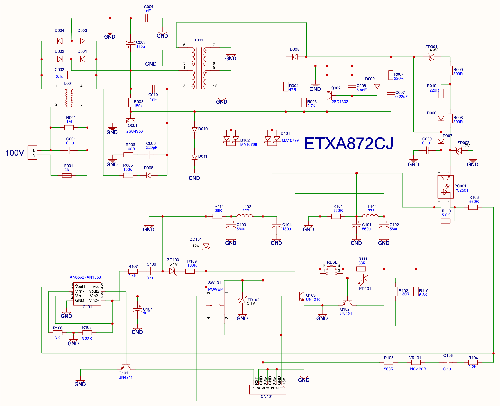
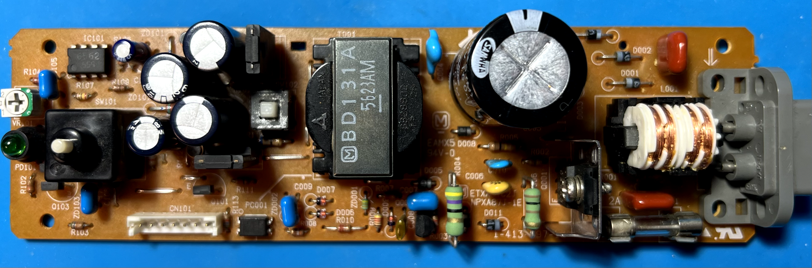
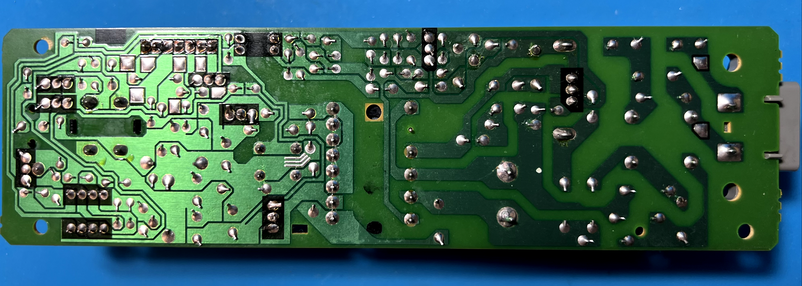
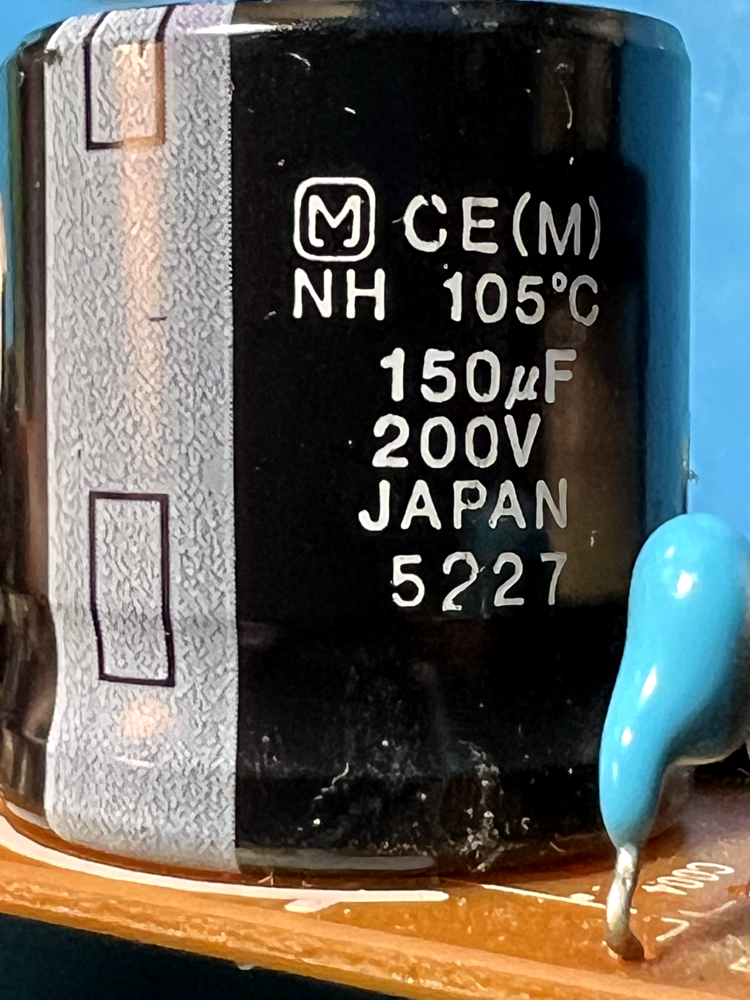
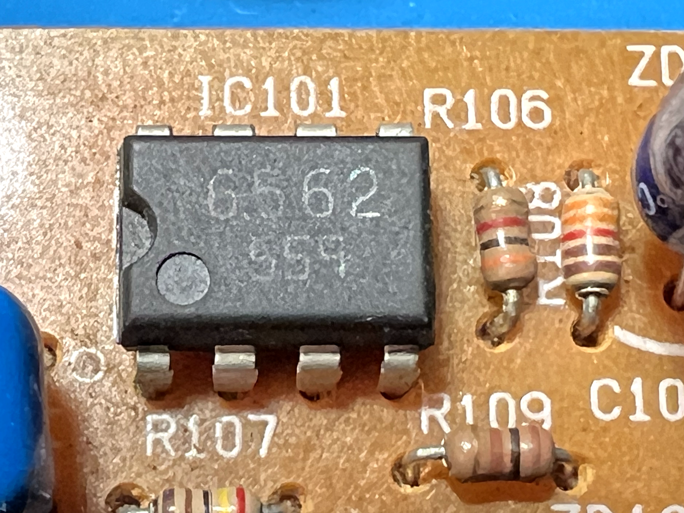

# Sony PlayStation (PSX/PS1) 7-pin internal PSU &ndash; ETXA87C2J Reverse Engineering

[](https://github.com/yourusername/ps1-psu-etxa87c2j)
[](LICENSE)

## ⚠️ IMPORTANT DISCLAIMER & PROJECT STATUS

**This is a Work in Progress (WIP).**

This repository contains my personal reverse-engineering efforts for the **Sony PlayStation 1 7-pin internal Power Supply Unit model ETXA87C2J** (Panasonic/Matsushita manufactured, Japan 100V variant).

### 🚧 Project Status & Known Limitations
- **Schematic is incomplete and UNVERIFIED:** The provided schematic is a best-effort reconstruction based on tracing a physical board. It may contain errors, missing components, or incorrect net labels.
- **Testing is ongoing:** I have **not yet fully verified** that the schematic is 100% accurate under all load conditions.
- **Use at your own risk:** This is a **high-voltage device**. Incorrect assumptions can lead to dangerous short circuits, component damage, or personal injury. Do not use this schematic as a primary source for manufacturing or cloning without independent verification.

### 🤝 Contributions & Corrections
If you spot an error, have additional information, or have successfully repaired your own ETXA87C2J PSU, I strongly encourage you to open a **GitHub Issue** or submit a **Pull Request** with your findings. Your contribution can help others.

---

## 📚 Overview
This repository documents the internal circuitry of the **ETXA87C2J** — a 7-pin internal PSU manufactured by Matsushita (Panasonic) for the Sony PlayStation 1. This is a **Japan (100V)** variant, found in SCPH-1000, early SCPH-1001, SCPH-3000/SCPH-3500 through SCPH-5000 consoles.

The goal is to provide:
1.  A clear, readable schematic for diagnostics and repair.
2.  Technical notes on the design, based on physical board tracing.

### Known Revisions

This schematic covers the **NPXA87J** family:

| Sony Part No. | Panasonic Part No. | Tested |
| :--- | :--- | :--- |
| 1-413-997-12 | ETXA87C2J (NPXA87J-1B) | |
| 1-413-997-13 | ETXA87C2J (NPXA87J-1C) | |
| 1-413-997-14 | ETXA87C2J (NPXA87J-1D) | &#9989; |
| 1-413-997-15 | ETXA87C2J (NPXA87J-1E) | &#9989; |

See [psdevwiki](https://psdevwiki.com/ps1/Power_supplies) for the full 7-pin PSU list.

## 📂 Repository Structure
```
ETXA87C2J/
├── README.md
├── schematics/
│   ├── ETXA87C2J.png          # Schematic image (raster)
│   └── ETXA87C2J.svg          # Schematic image (vector)
├── datasheets/
│   ├── AN1358.PDF             # AN6562 dual op-amp (IC101)
│   ├── MA10799.PDF            # Dual Schottky diode (D101/D102)
│   ├── PS2501.PDF             # Optocoupler (PC001)
│   ├── 2SC4953.PDF            # NPN transistor (Q001)
│   ├── 2SD1302.PDF            # Switching transistor (Q002)
│   └── UN4211.PDF             # Digital transistor (Q101-Q103)
├── img/
│   ├── top.png / bottom.png   # Board photos
│   └── ...                    # Component close-ups
└── project/
    └── SCH_PS1-PSU-7pin.eprj2 # EasyEDA source project
```

### Schematic



## 📷 Board Photos

Photos of the original board (high resolution, beware of file size).

### Top / Bottom

| Top side | Bottom side |
| :--- | :--- |
|  |  |

### Close-ups

| Component | Photo |
| :--- | :--- |
| **C003** (input filter cap) |  |
| **IC101** (AN6562 op-amp) |  |
| **PC001** (PS2501 optocoupler) |  |
| **Q001** (2SC4953 switching transistor) |  |

## 🔧 Component List & Common Substitutions

| Component | Original&nbsp;Label | Actual Chip / Function | Voltage | Note |
| :--- | :--- | :--- | :--- | :--- |
| **C001, C002** | 104K2B | 0.1&mu;F filter/decoupling capacitors (primary) | 250V | |
| **C003** | 150&mu;F 200V 105&deg;C | High-Voltage Filter Capacitor | 200V | Main capacitor, blows up when gets 230V |
| **C004** | 102M | 1nF capacitors (primary) | 250V | |
| **C006** | BE 221K 1kV | 220pF capacitor (primary) | 1000V | |
| **C007** | 224C | 0.22&mu;F capacitor (primary) | 250V | |
| **C008** | 682JF | 6.8nF capacitor (primary) | 1000V | |
| **C009** | 104C | 0.1&mu;F filter capacitor (primary) | 250V | |
| **C010** | HR102 | 0.1&mu;F filter capacitor (primary) | 250V | |
| **C101, C102, C103** | 560&mu;F 25V | Output Filter Capacitors | 25V | Could be replaced with **680&mu;F 25-35V** (Low ESR) for a minor upgrade |
| **C104** | 180&mu;F 16V | Output Filter Capacitor | 25V | Could be replaced with **220&mu;F 25-35V** (Low ESR) |
| **C105, C106** | 104C | 0.1&mu;F decoupling capacitors (secondary) | 250V | |
| **C107** | 1uF 50V | 1&mu;F capacitor (secondary) | 50V | |
| **D001&ndash;D011** | 045x | Rectifier diodes | 200V | Unknown type |
| **D101/D102** | MA10799 | **[MA10799](datasheets/MA10799.PDF)** &ndash; Dual Schottky Diodes, Common Cathode | 200V |Could be replaced with **STPS2045CT** |
| **F001** |250V 2A | Input fuse | 250V |
| **IC101** | 6562 | **[AN6562 (AN1358)](datasheets/AN1358.PDF)** &ndash; Dual Op-Amp Key feedback controller | 200V | Could be replaced with **LM358N / LM358P** |
| **L001** | | Common-mode choke | 200V | TBM |
| **L101, L102** | | Output inductors | 200V | TBM |
| **PC001** | 2501 | **[PS2501](datasheets/PS2501.PDF)** &ndash; Optocoupler (feedback isolation) | 200V | PS2501 |
| **PD101** | N/A | Power LED (green, 5mm) | N/A |
| **Q001** | C4953 | **[2SC4953](datasheets/2SC4953.PDF)** &ndash; NPN Transistor | 400V | Could be replaced with **ST13005** (verified compatible), but needs an insulator for heatsink to prevent collector-emitter short circuit |
| **Q002** | D1302 | **[2SD1302](datasheets/2SD1302.PDF)** &ndash; NPN-transistor | 20V | |
| **Q101, Q102** | N4211 | **[UN4211](datasheets/UN4211.PDF)** &ndash; Digital bias transistors | 50V | |
| **Q103** | N4210 | **[UN4210](datasheets/UN4211.PDF)** &ndash; Digital bias transistor | 50V | |
| **R001** | 🟫 ⬛ 🟩 🟡 | 1M&Omega; resistor | N/A | 1/4W, 5% |
| **R002** | 🟫 🟩 🟨 🟡 | 150k&Omega; resistor | N/A | 1/8W, 5%|
| **R003** | 🟥 🟪 🟥 🟡 | 2.7k&Omega; resistor | N/A | 1/8W, 5%|
| **R004** | 🟨 🟪 ⬛ 🟡 | 47&Omega; resistor | N/A | 1W, 5%|
| **R005** | 🟫 ⬛ 🟨 🟡 | 100k&Omega; resistor | N/A | 1/4W, 5%|
| **R006, R109** | 🟫 ⬛ 🟫 🟡 | 100&Omega; resistors | N/A | 1/2W, 5%|
| **R007, R010** | 🟥 🟥 🟫 🟡 | 220&Omega; resistors | N/A | 1/8W, 5%|
| **R008** | 🟧 ⚪️ 🟫 🟡 | 390&Omega; resistors | N/A | 1/8W, 5%|
| **R009** | 🟡 🟥 🟥 🟫 🟤 | 4.22k&Omega; resistors | N/A | 1/8W, 1%|
| **R101** | 🟧 🟧 🟫 🟡 | 330&Omega; resistor | N/A | 1/8W, 5%|
| **R102** | 🟫 🟧 🟫 🟡 | 130&Omega; resistor | N/A | 1/8W, 5%|
| **R103, R105** | 🟩 🟦 🟫 🟡 | 560&Omega; resistors | N/A | 1/8W, 5%|
| **R104** | 🟥 🟥 🟥 🟡 | 2.2k&Omega; resistor | N/A | 1/8W, 5%|
| **R106** | 🟧 ⬛ 🟥 🟡 | 3k&Omega; resistor | N/A | 1/8W, 5%|
| **R107** | 🟥 🟨 ⬛ 🟫 🟤 | 2.4k&Omega; resistor | N/A | 1/8W, 1%|
| **R108** | 🟧 🟧 🟥 🟫 🟤 | 3.32k&Omega; resistor | N/A | 1/8W, 1%|
| **R110** | 🟦 ◻️ 🟥 🟡 | 6.8k&Omega; resistor | N/A | 1/8W, 5%|
| **R111** | 🟧 🟧 ⬛ 🟡 | 33&Omega; resistor | N/A | 1/8W, 5%|
| **R113** | 🟩 🟦 🟥 🟡 | 5.6k&Omega; resistor | N/A | 1/8W, 5%|
| **R114** | 🟦 ◻️ ⬛ 🟡 | 68&Omega; resistor | N/A | 1/4W, 5%|
| **T001** | BD131A | Switching transformer | N/A | ??? | |
| **VR101** | N/A | Variable resistor (pot) | N/A | N/A | Usually reads in range 110&ndash;125&Omega; |
| **ZD001** | 🟨🟨 🟧 🟧 | 4.3V Zener Diode | 20V | 1/2W |
| **ZD002** | 🟨🟨 🟪 🟪 | 4.7V Zener Diode | 20V | 1/2W |
| **ZD101** | 🟫🟫 🟥 | 12V Zener Diode (1W) | 20V |1W |
| **ZD102** | 🟩🟩 🟫 🟫 | 5.1V Zener Diode | 20V | 1W |
| **ZD103** | 🟩🟩 🟫 🟫 | 5.1V Zener Diode | 20V | 1/2W |

#### Color Legend

| Emoji | Color |
| :--- | :--- |
| 🟥 | Red |
| 🟧 | Orange |
| 🟨 | Yellow |
| 🟩 | Green |
| 🟦 | Blue |
| 🟪 | Violet |
| 🟫 | Brown |
| ⬛ | Black |
| ⚪️ | **White** |
| ◻️ | **Grey** |
| 🟡 | Gold |
| 🟤 | Brown |

Resistor color bands are read as **digit – digit – multiplier – tolerance**. Zener diodes use the same codes, with the **first band doubled** (e.g. `🟨🟨` = yellow-yellow) to mark the cathode side, bands of same color mean decimal point (e.g. 🟩 = 5, 🟫 = 1, 🟩🟩 🟫 🟫  = 5.1V ). The circular emoji (🟡 / 🟤) represents the tolerance ring; all other rings are squares.

## 🛠️ How to Use This Information
1.  **Download the schematic:** Use it as a reference while troubleshooting your PSU.
2.  **Diagnose common faults:** Use the table above to identify and replace known failure points (e.g., capacitors, the IC101 op-amp, switching transistor Q001).
3.  **Understand the design:** Follow the circuit to learn how the PSU generates stable 7.6V and 3.3V outputs.
4.  **Discharge C003 before touching:** After unplugging from the mains, **discharge the input capacitor C003** with a discharge tool (screwdriver with insulated handle will do), or wait at least **5 minutes** for it to drain through the bleed resistors. The charge stays on the pins for a long time — do not skip this, it hurts.
5.  **Proceed with caution:** This is a line-powered switching power supply. Dangerous voltages are present inside. Work only if you have the necessary experience and safety equipment.

## 🧪 Testing & Verification Process
If the fuse **F001 blows** (e.g., during commissioning after repair), use an **incandescent bulb in series** with the PSU before plugging into the mains. The bulb limits current and protects the PSU from damage:

- **Bulb stays dark** = PSU is fine, no short circuit.
- **Bulb lights up and stays on** = something is shorted (bad rectifier diode, blown switching transistor, shorted filter cap). Find it before powering on.
- **Bulb briefly flashes then goes out** = normal inrush into C003, PSU is starting up as expected.
- Use a bulb with a power rating roughly matching the PSU's load (e.g., 40–100W for a ~50W PSU) so it doesn't drop too much voltage while testing.

## 📄 License

This project is licensed under the **CERN Open Hardware Licence Version 2 - Weakly Reciprocal (CERN-OHL-W)**. See the `LICENSE` file for the full text.

**TL;DR:** You are free to use, modify, and distribute this hardware design. If you modify the source (the schematics), you must share your changes under the same license. Commercial use is allowed, provided that the source of the design remains open and you give appropriate credit.

## 🙏 Acknowledgments
I dedicate this work to everyone keeping the PlayStation alive and well.

---
**Disclaimer:** I am not affiliated with Sony or Panasonic. All trademarks are the property of their respective owners. This project is for educational and repair purposes only.