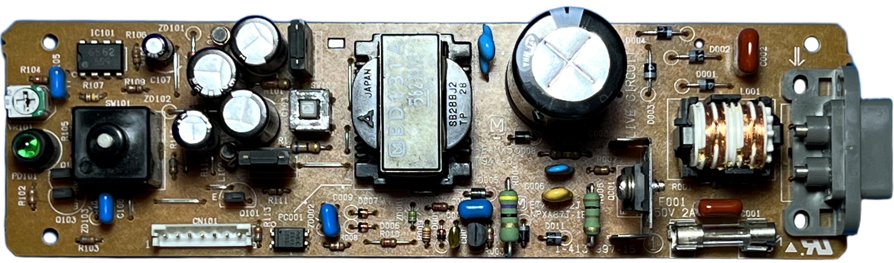
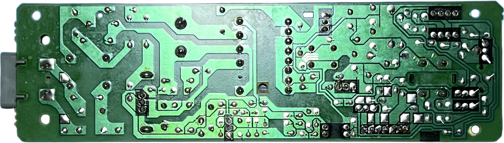
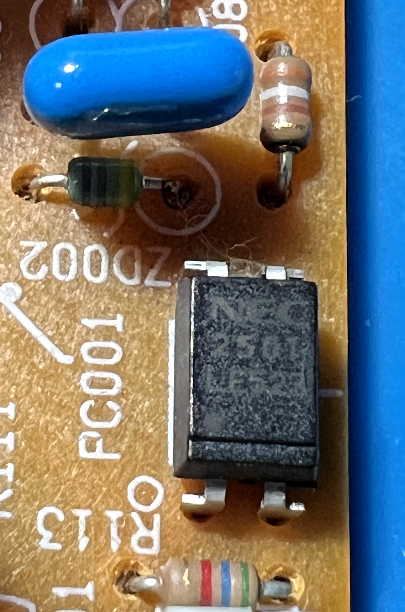
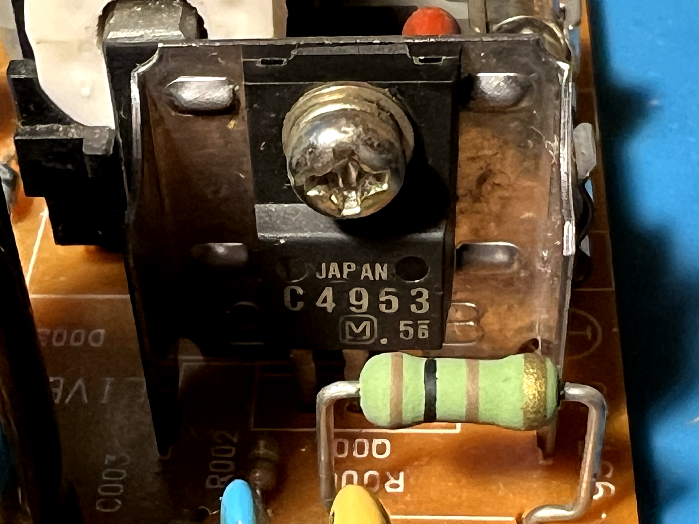

# Matsushita (Panasonic) ETXA87C2J (NPXA87J-1x) PSU for Sony PlayStation (PSX/PS1) &ndash; specs, schematics and photos

### 🚧 Status & Known Limitations
- **Schematic can be incomplete and is UNVERIFIED:** The provided schematic is a best-effort reconstruction based on tracing a physical board. It may contain errors, missing components, or incorrect net labels.
- **Testing is ongoing:** I have **not yet fully verified** that the schematic is 100% accurate under all load conditions.
- **Use at your own risk:** This is a **high-voltage device**. Incorrect assumptions can lead to dangerous short circuits, component damage, or personal injury. Do not use this schematic as a primary source for manufacturing or cloning without independent verification.

### Known Revisions

**ETXA87C2J** (**NPXA87J** family):

| Sony Part No. | Panasonic Part No. | Tested |
| :--- | :--- | :--- |
| 1-413-997-12 | ETXA87C2J (NPXA87J-1B) | |
| 1-413-997-13 | ETXA87C2J (NPXA87J-1C) | |
| 1-413-997-14 | ETXA87C2J (NPXA87J-1D) | &#9989; |
| 1-413-997-15 | ETXA87C2J (NPXA87J-1E) | &#9989; |

See [my document](../../psu/README.md) for the full (not sure)  PlayStation PSU list.

### Schematic

## 📷 Board Photos

### Top / Bottom

| Top side | Bottom side |
| :--- | :--- |
|  |  |

## 🔧 Component List & Common Substitutions

| Component | Original&nbsp;Label | Actual Chip / Function | Voltage | Note |
| :--- | :--- | :--- | :--- | :--- |
| **C001, C002** | 104K2B | 0.1&mu;F filter/decoupling capacitors (primary) | 250V | |
| **C003** | 150&mu;F 200V 105&deg;C | High-Voltage Filter Capacitor | 200V | Main capacitor, blows up when gets 230V |
| **C004** | 102M | 1nF capacitors (primary) | 250V | |
| **C006** | BE 221K 1kV | 220pF capacitor (primary) | 1000V | |
| **C007** | 224C | 0.22&mu;F capacitor (primary) | 250V | |
| **C008** | 682JF | 6.8nF capacitor (primary) | 1000V | |
| **C009** | 104C | 0.1&mu;F filter capacitor (primary) | 250V | |
| **C010** | HR102 | 0.1&mu;F filter capacitor (primary) | 250V | |
| **C101, C102, C103** | 560&mu;F 25V | Output Filter Capacitors | 25V | Could be replaced with **680&mu;F 25-35V** (Low ESR) for a minor upgrade |
| **C104** | 180&mu;F 16V | Output Filter Capacitor | 25V | Could be replaced with **220&mu;F 25-35V** (Low ESR) |
| **C105, C106** | 104C | 0.1&mu;F decoupling capacitors (secondary) | 250V | |
| **C107** | 1uF 50V | 1&mu;F capacitor (secondary) | 50V | |
| **D001&ndash;D011** | 045x | Rectifier diodes | 200V | Unknown type |
| **D101/D102** | MA10799 | **[MA10799](../../datasheets/MA10799.PDF)** &ndash; Dual Schottky Diodes, Common Cathode | 200V |Could be replaced with **STPS2045CT** |
| **F001** |250V 2A | Input fuse | 250V |
| **IC101** | 6562 | **[AN6562 (AN1358)](../../datasheets/AN1358.PDF)** &ndash; Dual Op-Amp Key feedback controller | 200V | Could be replaced with **LM358N / LM358P** |
| **L001** | | Common-mode choke | 200V | TBM |
| **L101, L102** | | Output inductors | 200V | TBM |
| **PC001** | 2501 | **[PS2501](../../datasheets/PS2501.PDF)** &ndash; Optocoupler (feedback isolation) | 200V | PS2501 |
| **PD101** | N/A | Power LED (green, 5mm) | N/A |
| **Q001** | C4953 | **[2SC4953](../../datasheets/2SC4953.PDF)** &ndash; NPN Transistor | 400V | Could be replaced with **ST13005** (verified compatible), but needs an insulator for heatsink to prevent collector-emitter short circuit |
| **Q002** | D1302 | **[2SD1302](../../datasheets/2SD1302.PDF)** &ndash; NPN-transistor | 20V | |
| **Q101, Q102** | N4211 | **[UN4211](../../datasheets/UN4211.PDF)** &ndash; Digital bias transistors | 50V | |
| **Q103** | N4210 | **[UN4210](../../datasheets/UN4211.PDF)** &ndash; Digital bias transistor | 50V | |
| **R001** | 🟫 ⬛ 🟩 🟡 | 1M&Omega; resistor | N/A | 1/4W, 5% |
| **R002** | 🟫 🟩 🟨 🟡 | 150k&Omega; resistor | N/A | 1/8W, 5%|
| **R003** | 🟥 🟪 🟥 🟡 | 2.7k&Omega; resistor | N/A | 1/8W, 5%|
| **R004** | 🟨 🟪 ⬛ 🟡 | 47&Omega; resistor | N/A | 1W, 5%|
| **R005** | 🟫 ⬛ 🟨 🟡 | 100k&Omega; resistor | N/A | 1/4W, 5%|
| **R006, R109** | 🟫 ⬛ 🟫 🟡 | 100&Omega; resistors | N/A | 1/2W, 5%|
| **R007, R010** | 🟥 🟥 🟫 🟡 | 220&Omega; resistors | N/A | 1/8W, 5%|
| **R008** | 🟧 ⚪️ 🟫 🟡 | 390&Omega; resistors | N/A | 1/8W, 5%|
| **R009** | 🟡 🟥 🟥 🟫 🟤 | 4.22k&Omega; resistors | N/A | 1/8W, 1%|
| **R101** | 🟧 🟧 🟫 🟡 | 330&Omega; resistor | N/A | 1/8W, 5%|
| **R102** | 🟫 🟧 🟫 🟡 | 130&Omega; resistor | N/A | 1/8W, 5%|
| **R103, R105** | 🟩 🟦 🟫 🟡 | 560&Omega; resistors | N/A | 1/8W, 5%|
| **R104** | 🟥 🟥 🟥 🟡 | 2.2k&Omega; resistor | N/A | 1/8W, 5%|
| **R106** | 🟧 ⬛ 🟥 🟡 | 3k&Omega; resistor | N/A | 1/8W, 5%|
| **R107** | 🟥 🟨 ⬛ 🟫 🟤 | 2.4k&Omega; resistor | N/A | 1/8W, 1%|
| **R108** | 🟧 🟧 🟥 🟫 🟤 | 3.32k&Omega; resistor | N/A | 1/8W, 1%|
| **R110** | 🟦 ◻️ 🟥 🟡 | 6.8k&Omega; resistor | N/A | 1/8W, 5%|
| **R111** | 🟧 🟧 ⬛ 🟡 | 33&Omega; resistor | N/A | 1/8W, 5%|
| **R113** | 🟩 🟦 🟥 🟡 | 5.6k&Omega; resistor | N/A | 1/8W, 5%|
| **R114** | 🟦 ◻️ ⬛ 🟡 | 68&Omega; resistor | N/A | 1/4W, 5%|
| **T001** | BD131A | Switching transformer | N/A | ??? | |
| **VR101** | N/A | Variable resistor (pot) | N/A | N/A | Usually reads in range 110&ndash;125&Omega; |
| **ZD001** | 🟨🟨 🟧 🟧 | 4.3V Zener Diode | 20V | 1/2W |
| **ZD002** | 🟨🟨 🟪 🟪 | 4.7V Zener Diode | 20V | 1/2W |
| **ZD101** | 🟫🟫 🟥 | 12V Zener Diode (1W) | 20V |1W |
| **ZD102** | 🟩🟩 🟫 🟫 | 5.1V Zener Diode | 20V | 1W |
| **ZD103** | 🟩🟩 🟫 🟫 | 5.1V Zener Diode | 20V | 1/2W |

#### Color Legend

| Emoji | Color |
| :--- | :--- |
| 🟥 | Red |
| 🟧 | Orange |
| 🟨 | Yellow |
| 🟩 | Green |
| 🟦 | Blue |
| 🟪 | Violet |
| 🟫 | Brown |
| ⬛ | Black |
| ⚪️ | **White** |
| ◻️ | **Grey** |
| 🟡 | Gold |
| 🟤 | Brown |

Resistor color bands are read as **digit – digit – multiplier – tolerance**. Zener diodes use the same codes, with the **first band doubled** (e.g. `🟨🟨` = yellow-yellow) to mark the cathode side, bands of same color mean decimal point (e.g. 🟩 = 5, 🟫 = 1, 🟩🟩 🟫 🟫  = 5.1V ). The circular emoji (🟡 / 🟤) represents the tolerance ring; all other rings are squares.

### Close-ups

| Component | Photo |
| :--- | :--- |
| **C003** (input filter cap) |  |
| **IC101** (AN6562 op-amp) |  |
| **PC001** (PS2501 optocoupler) |  |
| **Q001** (2SC4953 switching transistor) |  |