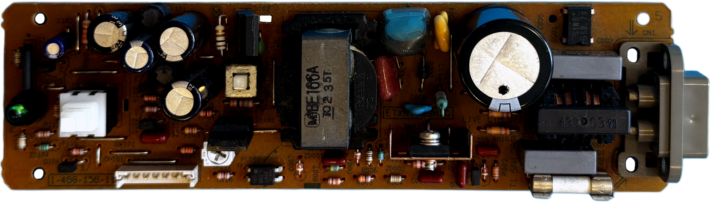
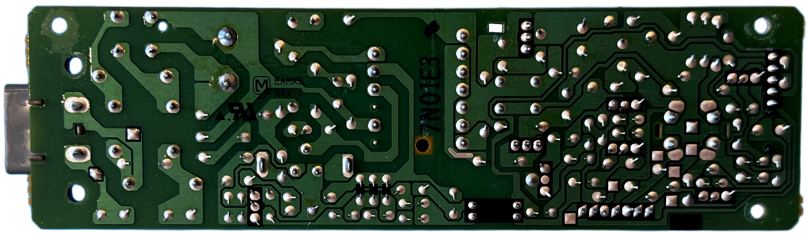

# Matsushita (Panasonic) ETXNY029 (NPX029J1-1) PSU for Sony PlayStation (PSX/PS1) &ndash; reverse engineering

Panasonic power supply family. Covers the Japanese 100-120V, North American 100-120V, European 220–240V and Asia universal 100–240V variants.

| Sony # | Manufacturer # | Voltage | Models | Notes |
| :--- | :--- | :--- | :--- | :--- |
| `1-413-997-16` | `ETXNY029J1C` (NPX029J1-1) | 100V | SCPH-1000, 3000, 3500, 5000 | Japan |
| `1-413-997-17` | `ETXNY029J1C` (NPX029J1-1A) | 100V | SCPH-1000, 3000, 3500, 5000 | Japan |
| `1-473-380-12` | `ETXNY029A1C` (NPX029A1-1A) | 120V | SCPH-1001 | North America |
| `1-473-380-13` | `ETXNY085A1C` | 120V | SCPH-1001 | North America |
| `1-473-383-12` | `ETXNY029E1C` (NPX029E1-1A) | 220–240V | SCPH-1002| Europe |
| `1-468-156-11` | `ETXNY029M1C` | 100–240V | SCPH-5003, 5903 | Asia (universal) |

## Schematics

_None yet._

## Photos

| Board top | Board bottom |
| :--- | :--- |
|  |  |

## Capacitors

Source: [RetroSix Wiki — Capacitors (Sony PlayStation 1)](https://retrosix.wiki/wiki/capacitors-sony-playstation-1). All THT.

### `1-473-380-12` — ETXNY029A1C

| Designator | Value | Voltage | Mounting |
| :--- | :--- | :--- | :--- |
| C107 | 1uF | 50V | THT |
| C003 | 120uF | 200V | THT |
| C104 | 180uF | 25V | THT |
| C105 | 180uF | 35V | THT |
| C102, C103 | 560uF | 25V | THT |

### `1-473-380-13` — ETXNY085A1C

| Designator | Value | Voltage | Mounting |
| :--- | :--- | :--- | :--- |
| C107 | 1uF | 50V | THT |
| C003 | 100uF | 200V | THT |
| C104 | 220uF | 25V | THT |
| C105 | 330uF | 25V | THT |
| C102, C103 | 560uF | 25V | THT |

### `1-468-156-11` — ETXNY029M1C

| Designator | Value | Voltage | Mounting |
| :--- | :--- | :--- | :--- |
| C107 | 1uF | 50V | THT |
| C005 | 82uF | 400V | THT |
| C104 | 180uF | 25V | THT |
| C105 | 180uF | 35V | THT |
| C102, C103 | 560uF | 25V | THT |