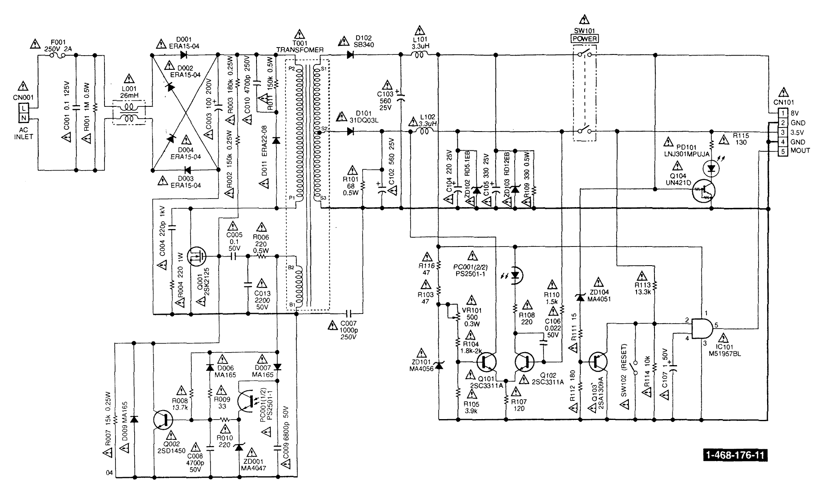
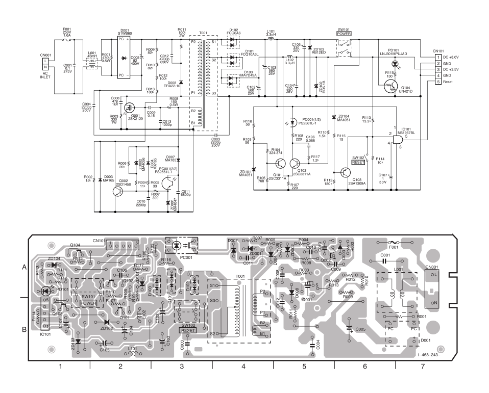
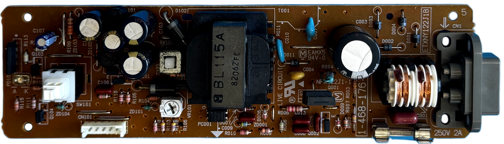
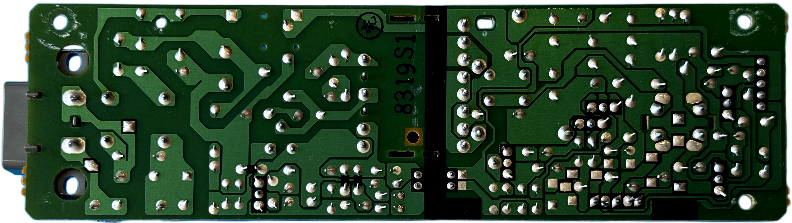
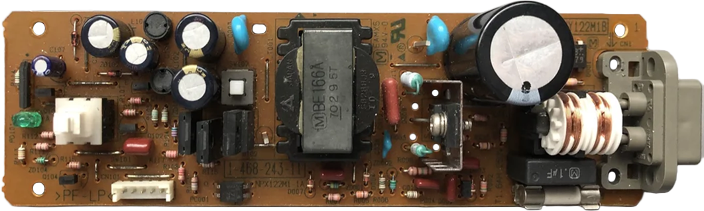

# Matsushita (Panasonic) ETXNY122 (NPX122J1-1) PSU for Sony PlayStation (PSX/PS1) &ndash; specs, schematics and photos

Late fat model power supply family.

| Sony # | Man&mu;Facturer # | Voltage | Models | Notes |
| :--- | :--- | :--- | :--- | :--- |
| `1-468-176-11` | `ETXNY122J1B` (NPX122J1-1) | 100V | SCPH-5500, 7000, 7500, 9000 | Japan |
| `1-468-218-11` | `ETXNY122A1B` (NPX122A1-1) | 120V | SCPH-5501, 7001, 7501, 9001 | North America |
| `1-468-219-21` | `ETXNY122E1B` (NPX122E1-1) | 220–240V | SCPH-5502, 7002, 7502, 9002 | Europe |
| `1-468-243-11` | `ETXNY122M1B` (NPX122M1-1A) | 100–240V | SCPH-5503, 7003, 7503, 9003 | Asia (universal) |

## Schematics

### `ETXNY122J1B` (NPX122J1-1)

### `ETXNY122M1B` (NPX122M1-1A)

## Photos

### ETXNY122J1B

| Board top | Board bottom |
| :--- | :--- |
|  |  |

### ETXNY122A1B

_None yet._

### ETXNY122E1B

_None yet._

### ETXNY122M1B

| Board top | Board bottom |
| :--- | :--- |
|  |  |

## 🔧 Component List

### ETXNY122J1B (1-468-176-11)
| Component | Original Label | Actual Chip / Function | Voltage | Note |
| :--- | :--- | :--- | :--- | :--- |
| **C001** | 104 | Film Capacitor | 125V | 0.1&mu;F, Part: ECQE1A104SJF |
| **C003** | — | Electrolytic Capacitor | 200V | 100&mu;F, Part: ECA2DHG101 |
| **C004** | 221 | Ceramic Capacitor | 1KV | 220pF, Part: ECKR3A221KBP |
| **C005** | 104 | Film Capacitor | 50V | 0.1&mu;F, Part: ECQV1H104JL |
| **C007** | 102 | Ceramic Capacitor | 250V | 1000pF, Part: 250E102M |
| **C008** | 472 | Film Capacitor | 50V | 4700pF, Part: ECQB1H472JF |
| **C009** | 682 | Film Capacitor | 50V | 6800pF, Part: ECQB1H682KF |
| **C010** | 472 | Ceramic Capacitor | 250V | 4700pF, Part: HRR2R472K |
| **C013** | 222 | Film Capacitor | 50V | 2200pF, Part: ECQB1H222JF |
| **C102** | — | Electrolytic Capacitor | 25V | 560&mu;F, Part: EE&mu;FC1E561 |
| **C103** | — | Electrolytic Capacitor | 25V | 560&mu;F, Part: EE&mu;FC1E561 |
| **C104** | — | Electrolytic Capacitor | 25V | 220&mu;F, Part: EE&mu;FC1E221 |
| **C105** | — | Electrolytic Capacitor | 25V | 330&mu;F, Part: EE&mu;FC1E331 |
| **C106** | 223 | Film Capacitor | 50V | 0.022&mu;F, Part: ECQB1H223KF |
| **C107** | — | Electrolytic Capacitor | 50V | 1&mu;F, Part: ECEA1HU010 |
| **D001** | — | Rectifier Diode | 400V | 1A, Part: ERA15-04 |
| **D002** | — | Rectifier Diode | 400V | 1A, Part: ERA15-04 |
| **D003** | — | Rectifier Diode | 400V | 1A, Part: ERA15-04 |
| **D004** | — | Rectifier Diode | 400V | 1A, Part: ERA15-04 |
| **D006** | — | Signal Diode | 80V | 0.15A, Part: MA165 |
| **D007** | — | Signal Diode | 80V | 0.15A, Part: MA165 |
| **D009** | — | Signal Diode | 80V | 0.15A, Part: MA165 |
| **D011** | — | Fast Recovery Diode | 800V | 0.5A, Part: ERA22-08 |
| **D101** | — | Schottky Diode | 30V | 3A, Part: 31DQ03L |
| **D102** | — | Schottky Diode | 40V | 3A, Part: SB340 |
| **F101** | — | Fuse | 250V | 2A, Part: 232002V2 |
| **IC101** | M51957BL | Reset / Supervisory IC | — | Part: M51957BL |
| **L001** | — | Common-mode Choke | — | 26mH, 0.4A, Part: ELF15N004A |
| **L101** | 3R3 | Output Inductor | — | 3.3&mu;H, 2.5A |
| **L102** | 3R3 | Output Inductor | — | 3.3&mu;H, 2.5A |
| **PC001** | PS2501-1 | Optocoupler | — | Part: PS2501-1 |
| **PD101** | — | Power LED | — | 90mW, 30mA, Part: LNJ301MPUJA |
| **Q001** | 2SK2125 | N-Channel Power MOSFET | 500V | 40W, Part: 2SK2125 |
| **Q002** | 2SD1450 | NPN Transistor | 20V | 0.3W, Part: 2SD1450 |
| **Q101** | 2SC3311A | NPN Transistor | 50V | 0.3W, Part: 2SC3311A |
| **Q102** | 2SC3311A | NPN Transistor | 50V | 0.3W, Part: 2SC3311A |
| **Q103** | 2SA1309A | PNP Transistor | 50V | 0.3W, Part: 2SA1309A |
| **Q104** | UN421D | Digital Transistor | 50V | 0.3W, Part: UN421D |
| **R001** | 🟫 ⬛ 🟩 🟡 | Resistor | — | 1M&Omega;, 1/2W, 5% |
| **R002** | 🟫 🟩 🟨 🟡 | Resistor | — | 150k&Omega;, 1/4W, 5% |
| **R003** | 🟫 ◻️ 🟨 🟡 | Resistor | — | 180k&Omega;, 1/4W, 5% |
| **R004** | 🟥 🟥 🟫 🟡 | Resistor | — | 220&Omega;, 1W, 5% |
| **R006** | 🟥 🟥 🟫 🟡 | Resistor | — | 220&Omega;, 1/2W, 5% |
| **R007** | 🟫 🟩 🟧 🟡 | Resistor | — | 15k&Omega;, 1/4W, 5% |
| **R008** | 🟫 🟧 🟪 🟥 🟤 | Resistor | — | 13.7k&Omega;, 1/4W, 1% |
| **R009** | 🟧 🟧 ⬛ 🟡 | Resistor | — | 33&Omega;, 1/4W, 5% |
| **R010** | 🟥 🟥 🟫 🟡 | Resistor | — | 220&Omega;, 1/4W, 5% |
| **R011** | 🟫 🟩 🟨 🟡 | Resistor | — | 150k&Omega;, 1/2W, 5% |
| **R101** | 🟦 ◻️ ⬛ 🟡 | Resistor | — | 68&Omega;, 1/2W, 5% |
| **R103** | 🟨 🟪 ⬛ 🟡 | Resistor | — | 47&Omega;, 1/4W, 5% |
| **R104** | 🟫 ◻️ 🟥 🟡 | Resistor | — | 1.8k&Omega; / 1.9k&Omega; / 2k&Omega;, 1/4W, 5% |
| **R105** | 🟧 ⬜ 🟥 🟡 | Resistor | — | 3.9k&Omega;, 1/4W, 5% |
| **R107** | 🟫 🟥 🟫 🟡 | Resistor | — | 120&Omega;, 1/4W, 5% |
| **R108** | 🟥 🟥 🟫 🟡 | Resistor | — | 220&Omega;, 1/4W, 5% |
| **R109** | 🟧 🟧 🟫 🟡 | Resistor | — | 330&Omega;, 1/2W, 5% |
| **R110** | 🟫 🟧 🟥 🟡 | Resistor | — | 1.3k&Omega;, 1/4W, 5% |
| **R111** | 🟫 🟩 ⬛ 🟡 | Resistor | — | 15&Omega;, 1/4W, 5% |
| **R112** | 🟫 ◻️ 🟫 🟡 | Resistor | — | 180&Omega;, 1/4W, 5% |
| **R113** | 🟫 🟧 🟧 🟥 🟤 | Resistor | — | 13.3k&Omega;, 1/4W, 1% |
| **R114** | 🟫 ⬛ ⬛ 🟥 🟤 | Resistor | — | 10k&Omega;, 1/4W, 1% |
| **R115** | 🟫 🟧 🟫 🟡 | Resistor | — | 130&Omega;, 1/4W, 5% |
| **R116** | 🟨 🟪 ⬛ 🟡 | Resistor | — | 47&Omega;, 1/4W, 5% |
| **SW101** | — | Power Switch | 12V | 3A, Part: SLASBB03 |
| **SW102** | — | Reset Switch | 12V | 3A, Part: ESE20B6 |
| **T001** | ETB29KL115## | Switching Transformer | — | Part: ETB29KL115## |
| **VR101** | 500 | Variable Resistor | — | 500&Omega;, 0.3W, Part: EVMEA5A01B52 |
| **ZD001** | 🟨 🟨 🟪 🟪 | Zener Diode | — | 4.7V, 0.4W, Part: MA4047 |
| **ZD101** | 🟩 🟩 🟦 🟦 | Zener Diode | — | 5.6V, 0.4W, Part: MA4056 |
| **ZD102** | 🟩 🟩 🟫 🟫 | Zener Diode | — | 5.1V, 1/2W, Part: RD5.1EB |
| **ZD103** | 🟫 🟫 🟥 | Zener Diode | — | 12V, 1/2W, Part: RD12EB |
| **ZD104** | 🟩 🟩 🟫 🟫 | Zener Diode | — | 5.1V, 0.4W, Part: MA4051 |

### ETXNY122A1B (1-468-218-11)

| Component | Original Label | Actual Chip / Function | Voltage | Note |
| :--- | :--- | :--- | :--- | :--- |
| **C001** | 0.1&mu;F | Film Capacitor | 275V | Part: MKP20104M |
| **C003** | 100&mu;F | Electrolytic Capacitor | 200V | Part: ECA2DHG101 |
| **C004** | 220PF | Ceramic Capacitor | 1KV | Part: ECKR3A221KBP |
| **C005** | 0.1&mu;F | Film Capacitor | 50V | Part: ECQV1H104JL |
| **C007** | 1000PF | Ceramic Capacitor | 250V | Part: KH102M |
| **C008** | 4700PF | Film Capacitor | 50V | Part: ECQB1H472JF |
| **C009** | 6800PF | Film Capacitor | 50V | Part: ECQB1H682KF |
| **C010** | 4700PF | Ceramic Capacitor | 250V | Part: HRR2R472K |
| **C013** | 2200PF | Film Capacitor | 50V | Part: ECQB1H222JF |
| **C102** | 560&mu;F | Electrolytic Capacitor | 25V | Part: EE&mu;FC1E561 |
| **C103** | 560&mu;F | Electrolytic Capacitor | 25V | Part: EE&mu;FC1E561 |
| **C104** | 220&mu;F | Electrolytic Capacitor | 25V | Part: EE&mu;FC1E221 |
| **C105** | 330&mu;F | Electrolytic Capacitor | 25V | Part: EE&mu;FC1E331 |
| **C106** | 0.022&mu;F | Film Capacitor | 50V | Part: ECQB1H223KF |
| **C107** | 1&mu;F | Electrolytic Capacitor | 50V | Part: ECEA1HU010 |
| **D001** | — | Rectifier Diode | 400V | 1A, Part: ERA15-04 |
| **D002** | — | Rectifier Diode | 400V | 1A, Part: ERA15-04 |
| **D003** | — | Rectifier Diode | 400V | 1A, Part: ERA15-04 |
| **D004** | — | Rectifier Diode | 400V | 1A, Part: ERA15-04 |
| **D006** | — | Signal Diode | 80V | 0.15A, Part: MA165 |
| **D007** | — | Signal Diode | 80V | 0.15A, Part: MA165 |
| **D009** | — | Signal Diode | 80V | 0.15A, Part: MA165 |
| **D011** | — | Fast Recovery Diode | 800V | 0.5A, Part: ERA22-08 |
| **D101** | — | Schottky Diode | 30V | 3A, Part: 31DQ03L |
| **D102** | — | Schottky Diode | 40V | 3A, Part: SB340 |
| **F001** | — | Fuse | 250V | 2A, Part: 239 2A |
| **IC101** | M51957BL | Reset / Supervisory IC | — | Part: M51957BL |
| **L001** | — | Common-mode Choke | — | 26mH, 0.4A, Part: ELF15N004A |
| **L101** | 3R3 | Output Inductor | — | 3.3&mu;H, 2.5A, Part: 3R3N |
| **L102** | 3R3 | Output Inductor | — | 3.3&mu;H, 2.5A, Part: 3R3N |
| **PC001** | PS2501-1 | Optocoupler | — | Part: PS2501-1 |
| **PD101** | — | Power LED | — | 90mW, 30mA, Part: LNJ301MPUJA |
| **Q001** | 2SK2125 | N-Channel Power MOSFET | 500V | 40W, Part: 2SK2125 |
| **Q002** | 2SD1450 | NPN Transistor | 20V | 0.3W, Part: 2SD1450 |
| **Q101** | 2SC3311A | NPN Transistor | 50V | 0.3W, Part: 2SC3311A |
| **Q102** | 2SC3311A | NPN Transistor | 50V | 0.3W, Part: 2SC3311A |
| **Q103** | 2SA1309A | PNP Transistor | 50V | 0.3W, Part: 2SA1309A |
| **Q104** | UN421D | Digital Transistor | 50V | 0.3W, Part: UN421D |
| **R001** | 🟫 ⬛ 🟩 🟡 | Resistor | — | 1M&Omega;, 1/2W, Part: ERDS1TJ105 |
| **R002** | 🟦 ◻️ 🟩 🟡 | Resistor | — | 6.8M&Omega;, 1/2W, Part: ERC12UGK685 |
| **R003** | 🟫 ◻️ 🟨 🟡 | Resistor | — | 180k&Omega;, 1/4W, Part: ERDS2TJ184 |
| **R004** | 🟥 🟥 🟫 🟡 | Resistor | — | 220&Omega;, 1W, Part: ERG1SJ221 |
| **R005** | 🟫 🟩 🟨 🟡 | Resistor | — | 150k&Omega;, 1/4W, Part: ERDS2TJ154 |
| **R006** | 🟥 🟥 🟫 🟡 | Resistor | — | 220&Omega;, 1/2W, Part: ERDS1TJ221 |
| **R007** | 🟫 🟩 🟧 🟡 | Resistor | — | 15k&Omega;, 1/4W, Part: ERDS2TJ153 |
| **R008** | 🟫 🟧 🟪 🟥 🟤 | Resistor | — | 13.7k&Omega;, 1/4W, Part: ERDS2TKF1372 |
| **R009** | 🟧 🟧 ⬛ 🟡 | Resistor | — | 33&Omega;, 1/4W, Part: ERDS2TJ330 |
| **R010** | 🟥 🟥 🟫 🟡 | Resistor | — | 220&Omega;, 1/4W, Part: ERDS2TJ221 |
| **R011** | 🟫 🟩 🟨 🟡 | Resistor | — | 150k&Omega;, 1/2W, Part: ERDS1TJ154 |
| **R101** | 🟦 ◻️ ⬛ 🟡 | Resistor | — | 68&Omega;, 1/2W, Part: ERDS1TJ680 |
| **R103** | 🟨 🟪 ⬛ 🟡 | Resistor | — | 47&Omega;, 1/4W, Part: ERDS2TJ470 |
| **R104** | 🟫 ◻️ 🟥 🟡 | Resistor | — | 1.8k&Omega;, 1/4W, Part: ERDS2TJ182 |
| **R105** | 🟧 ⬜ 🟥 🟡 | Resistor | — | 3.9k&Omega;, 1/4W, Part: ERDS2TJ392 |
| **R106** | 🟥 🟥 🟥 🟡 | Resistor | — | 2.2k&Omega;, 1/4W, Part: ERDS2TJ222 |
| **R107** | 🟫 🟥 🟫 🟡 | Resistor | — | 120&Omega;, 1/4W, Part: ERDS2TJ121 |
| **R108** | 🟥 🟥 🟫 🟡 | Resistor | — | 220&Omega;, 1/4W, Part: ERDS2TJ221 |
| **R109** | 🟧 🟧 🟫 🟡 | Resistor | — | 330&Omega;, 1/2W, Part: ERDS1TJ331 |
| **R110** | 🟫 🟩 🟥 🟡 | Resistor | — | 1.5k&Omega;, 1/4W, Part: ERDS2TJ152 |
| **R111** | 🟫 🟩 ⬛ 🟡 | Resistor | — | 15&Omega;, 1/4W, Part: ERDS2TJ150 |
| **R112** | 🟫 ◻️ 🟫 🟡 | Resistor | — | 180&Omega;, 1/4W, Part: ERDS2TJ181 |
| **R113** | 🟫 🟧 🟧 🟥 🟤 | Resistor | — | 13.3k&Omega;, 1/4W, Part: ERDS2TKF1332 |
| **R114** | 🟫 ⬛ ⬛ 🟥 🟤 | Resistor | — | 10k&Omega;, 1/4W, Part: ERDS2TKF1002 |
| **R115** | 🟫 🟧 🟫 🟡 | Resistor | — | 130&Omega;, 1/4W, Part: ERDS2TJ131 |
| **R116** | 🟨 🟪 ⬛ 🟡 | Resistor | — | 47&Omega;, 1/4W, Part: ERDS2TJ470 |
| **SW101** | — | Power Switch | 12V | 3A, Part: SLASBB03 |
| **SW102** | — | Reset Switch | 12V | 3A, Part: ESE20B6 |
| **T001** | ETB29KL115## | Switching Transformer | — | Part: ETB29KL115## |
| **VR101** | 500 | Variable Resistor | — | 500&Omega;, 0.3W, Part: EVMEA5A01B52 |
| **ZD001** | 🟨 🟨 🟪 🟪 | Zener Diode | — | 4.7V, 0.4W, Part: MA4047 |
| **ZD101** | 🟩 🟩 🟦 🟦 | Zener Diode | — | 5.6V, 0.4W, Part: MA4056 |
| **ZD102** | 🟩 🟩 🟫 🟫 | Zener Diode | — | 5.1V, 1/2W, Part: RD5.1EB |
| **ZD103** | 🟫 🟫 🟥 | Zener Diode | — | 12V, 1/2W, Part: RD12EB |
| **ZD104** | 🟩 🟩 🟫 🟫 | Zener Diode | — | 5.1V, 0.4W, Part: MA4051 |

### ETXNY122E1B (1-468-219-21)

_None yet._

### ETXNY122M1B (1-468-243-11)

| Component | Original Label | Actual Chip / Function | Voltage | Note |
| :--- | :--- | :--- | :--- | :--- |
| **C001** | 0.1&mu;F | Film Capacitor | 275V | Part: MKP20104M |
| **C003** | 2200pF | Ceramic Capacitor | 250V | Part: KH222M |
| **C004** | 2200pF | Ceramic Capacitor | 250V | Part: KH222M |
| **C005** | 82&mu;F | Electrolytic Capacitor | 400V | Part: ECO-S2GB820 |
| **C008** | 47pF | Ceramic Capacitor | 1kV | Part: DE1SL470J |
| **C009** | 0.15&mu;F | Film Capacitor | 50V | Part: ECQV1H154JL |
| **C010** | 2200pF | Film Capacitor | 50V | Part: ECQB1H222JF |
| **C011** | 6800pF | Film Capacitor | 50V | Part: ECQB1H682KF |
| **C012** | 4700pF | Film Capacitor | 630V | Part: ECQE6472KZ |
| **C013** | 1000pF | Film Capacitor | 50V | Part: ECQB1H102JF |
| **C102** | 560&mu;F | Electrolytic Capacitor | 25V | Part: EEUFC1E561 |
| **C103** | 560&mu;F | Electrolytic Capacitor | 25V | Part: EEUFC1E561 |
| **C104** | 220&mu;F | Electrolytic Capacitor | 25V | Part: EEUFC1E221 |
| **C105** | 330&mu;F | Electrolytic Capacitor | 25V | Part: EEUFC1E331 |
| **C106** | 0.068&mu;F | Film Capacitor | 50V | Part: ECQB1H683 |
| **C107** | 1&mu;F | Electrolytic Capacitor | 50V | Part: ECEA1HU010 |
| **D001** | — | Rectifier Diode | 600V | 1A, Part: S1WB60 |
| **D003** | — | Signal Diode | 80V | 0.15A, Part: MA165 |
| **D004** | — | Signal Diode | 80V | 0.15A, Part: MA165 |
| **D007** | — | Signal Diode | 80V | 0.15A, Part: MA165 |
| **D008** | — | Fast Recovery Diode | 1kV | 0.5A, Part: ERA22-10 |
| **D101** | — | Schottky Diode | 35V | 10A, Part: FCQ10A3L |
| **D102** | — | Schottky Diode | 60V | 6A, Part: FCQ6A6 |
| **D103** | — | Schottky Diode | 45V | 5A, Part: MA7049A |
| **F001** | — | Fuse | 250V | 1.6A, Part: 19181 1.6A |
| **IC101** | M51957BL | Reset / Supervisory IC | 1.25V | Part: M51957BL |
| **L001** | — | Filter Choke | — | 43mH, 0.3A, Part: ELF15N003A |
| **L101** | — | Choke | — | 3.3&mu;H, 2.5A, Part: 3R3N |
| **L102** | — | Choke | — | 3.3&mu;H, 2.5A, Part: 3R3N |
| **PC001** | PS2561L-1 | Optoisolator | — | Part: PS2561L-1 |
| **PD101** | — | LED | — | 90mW, 30mA, Part: LNJ301MPUJAD |
| **Q001** | 2SK2129 | N-Channel Power MOSFET | 800V | 50W, Part: 2SK2129 |
| **Q002** | 2SD1450 | NPN Transistor | 25V | 0.3W, Part: 2SD1450 |
| **Q101** | 2SC3311A | NPN Transistor | 50V | 0.3W, Part: 2SC3311A |
| **Q102** | 2SC3311A | NPN Transistor | 50V | 0.3W, Part: 2SC3311A |
| **Q103** | 2SA1309A | PNP Transistor | 50V | 0.3W, Part: 2SA1309A |
| **Q104** | UN421D | Digital Transistor | 50V | 0.3W, Part: UN421D |
| **R001** | 🟨 🟪 🟨 🟡 | Carbon Resistor | — | 470k&Omega;, 0.5W, Part: ERDS1TJ474 |
| **R002** | 🟫 🟩 🟧 🟡 | Carbon Resistor | — | 15k&Omega;, 0.25W, Part: ERDS2TJ153 |
| **R003** | 🟧 🟧 🟫 🟡 | Metal Oxide Resistor | — | 330&Omega;, 1W, Part: ERG1ST331 |
| **R004** | 🟫 🟫 ⬛ 🟥 🟤 | Metal Resistor | — | 11k&Omega;, 0.25W, Part: ERDS2TKF1102 |
| **R005** | 🟧 🟧 ⬛ 🟡 | Carbon Resistor | — | 33&Omega;, 0.25W, Part: ERDS2TJ330 |
| **R006** | 🟥 ⬛ ⬛ 🟥 🟤 | Metal Resistor | — | 20k&Omega;, 0.25W, Part: ERDS2TKF2002 |
| **R007** | 🟧 ⬜ 🟫 🟡 | Carbon Resistor | — | 390&Omega;, 0.25W, Part: ERDS2TJ391 |
| **R008** | 🟫 🟩 🟫 🟡 | Carbon Resistor | — | 150&Omega;, 0.5W, Part: ERDS1TJ151 |
| **R009** | ◻️ 🟥 🟧 🟡 | Carbon Resistor | — | 82k&Omega;, 0.25W, Part: ERDS2TJ823 |
| **R010** | ◻️ 🟥 🟧 🟡 | Carbon Resistor | — | 82k&Omega;, 0.25W, Part: ERDS2TJ823 |
| **R011** | 🟫 ⬛ 🟨 🟡 | Metal Oxide Resistor | — | 100k&Omega;, 2W, Part: ERG2SJ104 |
| **R012** | 🟫 ⬛ 🟨 🟡 | Carbon Resistor | — | 100k&Omega;, 0.25W, Part: ERDS2TJ104 |
| **R013** | 🟫 ⬛ 🟨 🟡 | Carbon Resistor | — | 100k&Omega;, 0.25W, Part: ERDS2TJ104 |
| **R103** | 🟩 🟦 ⬛ 🟡 | Carbon Resistor | — | 56&Omega;, 0.25W, Part: ERDS2TJ560 |
| **R104** | 324-374 | Metal Resistor | — | 324–374&Omega;, 0.25W, Part: ERDS2TKF3240-3740 |
| **R105** | 🟪 🟦 ◻️ ⬛ 🟤 | Metal Resistor | — | 768&Omega;, 0.25W, Part: ERDS2TKF7680 |
| **R107** | 🟥 🟥 🟫 🟡 | Carbon Resistor | — | 220&Omega;, 0.25W, Part: ERDS2TJ221 |
| **R108** | 🟥 🟥 🟫 🟡 | Carbon Resistor | — | 220&Omega;, 0.25W, Part: ERDS2TJ221 |
| **R110** | 🟫 🟩 🟥 🟡 | Carbon Resistor | — | 1.5k&Omega;, 0.25W, Part: ERDS2TJ152 |
| **R111** | 🟫 🟩 ⬛ 🟡 | Carbon Resistor | — | 15&Omega;, 0.25W, Part: ERDS2TJ150 |
| **R112** | 🟫 ◻️ 🟫 🟡 | Carbon Resistor | — | 180&Omega;, 0.25W, Part: ERDS2TJ181 |
| **R113** | 🟫 🟧 🟧 🟥 🟤 | Metal Resistor | — | 13.3k&Omega;, 0.25W, Part: ERDS2TKF1332 |
| **R114** | 🟫 ⬛ ⬛ 🟥 🟤 | Metal Resistor | — | 10k&Omega;, 0.25W, Part: ERDS2TKF1002 |
| **R115** | 🟫 🟧 🟫 🟡 | Carbon Resistor | — | 130&Omega;, 0.25W, Part: ERDS2TJ131 |
| **R116** | 🟩 🟦 ⬛ 🟡 | Carbon Resistor | — | 56&Omega;, 0.25W, Part: ERDS2TJ560 |
| **R117** | 🟫 🟥 🟥 🟡 | Carbon Resistor | — | 1.2k&Omega;, 0.25W, Part: ERDS2TJ122 |
| **SW101** | — | Switch | — | Part: ESB32101M |
| **SW102** | — | Switch | — | Part: ESE20B6 |
| **T001** | ETB28AE166•• | Transformer | — | Part: ETB28AE166•• |
| **ZD001** | 🟨🟨 🟪 🟪 | Zener Diode | — | 4.7V, 0.4W, Part: MA4047 |
| **ZD002** | 🟩🟩 🟦 🟦 | Zener Diode | — | 5.6V, 0.4W, Part: MA4056 |
| **ZD101** | 🟩🟩 🟫 🟫 | Zener Diode | — | 5.1V, 0.4W, Part: MA4051 |
| **ZD102** | 🟩🟩 🟫 🟫 | Zener Diode | — | 5.1V, 0.5W, Part: RD5.1B |
| **ZD103** | 🟫🟫 🟥 | Zener Diode | — | 12V, 0.5W, Part: RD12EB |
| **ZD104** | 🟩🟩 🟫 🟫 | Zener Diode | — | 5.1V, 0.4W, Part: MA4051 |

⚠️ Some silkscreen/part code values that differ from the official Sony list (kept as physically marked):

- **L101 / L102** — manual: `3.3mH`; silkscreen `3R3` decodes as **3.3&mu;H** (R = decimal point).
- **R003** — manual: `300, 1W`; part `ERG1ST331` = **330&Omega;, 1W**.
- **C001** — manual: `0.1µF, 257V`; X-cap `MKP20104M` = **275V AC**.
- **D007** — manual lists it twice; the `1kV, 0.5A` entry corresponds to **D008**.
- **R112** — manual: `180kΩ`; part `ERDS2TJ181` = **180&Omega;**.

#### Color Legend

| Emoji | Color |
| :--- | :--- |
| 🟥 | Red |
| 🟧 | Orange |
| 🟨 | Yellow |
| 🟩 | Green |
| 🟦 | Blue |
| 🟪 | Violet |
| 🟫 | Brown |
| ⬛ | Black |
| ⬜ | **White** |
| ◻️ | **Grey** |
| ⚪ | **Silver** (×0.01 multiplier) |
| 🟡 | Gold |
| 🟤 | Brown |

Resistor color bands are read as **digit – digit – multiplier – tolerance**; 1% (F) parts use five bands, **digit – digit – digit – multiplier – tolerance**. Zener diodes use the same codes, with the **first band doubled** (e.g. `🟨🟨` = yellow-yellow) to mark the cathode side, bands of same color mean decimal point (e.g. 🟩 = 5, 🟫 = 1, 🟩🟩 🟫 🟫  = 5.1V ). The tolerance ring is circular: 🟡 gold (5%), 🟤 brown (1%); `⚪` silver (×0.01) is a multiplier band, not a tolerance. All value bands are squares (⬛ black, ⬜ white, ◻️ grey, …). In the multiplier slot `🟡` = gold (×0.1) and `⚪` = silver (×0.01).
