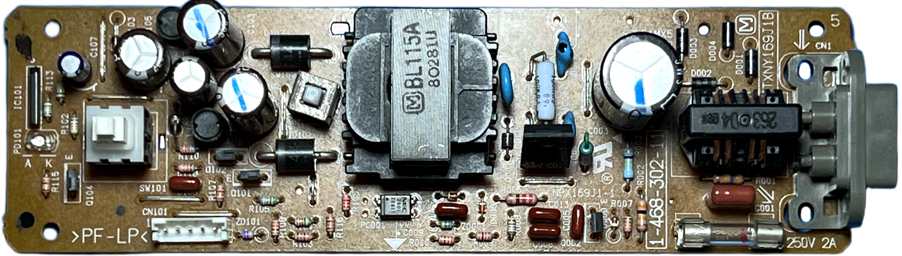
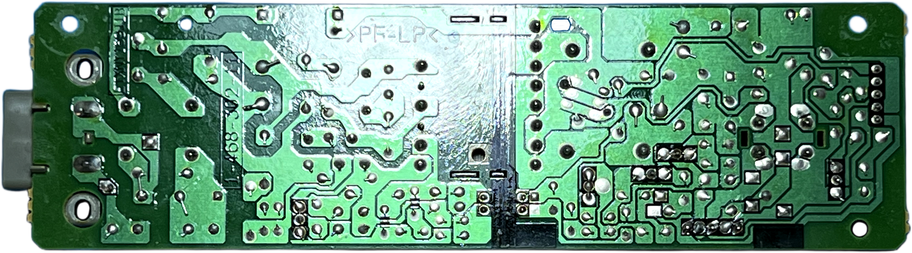
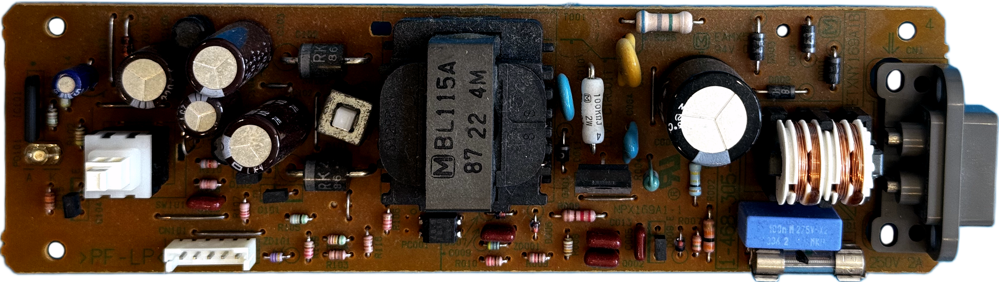
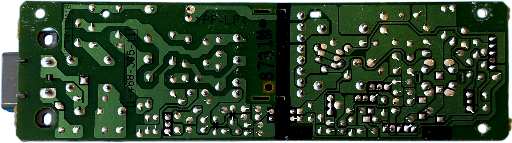

# Matsushita (Panasonic) ETXNY169 (NPX169J1-1) PSU for Sony PlayStation (PSX/PS1) &ndash; specs, schematics and photos

Late fat model power supply family.

| Sony # | Man&mu;Facturer # | Voltage | Models | Notes |
| :--- | :--- | :--- | :--- | :--- |
| `1-468-302-11` | `ETXNY169J1B` (NPX169J1-1) | 100V | 7000, 7500, 9000 | Japan |
| `1-468-305-11` | `ETXNY169A1B` (NPXA169A1) | 120V | 7001, 7501, 9001 | North America |

## Schematics

_None yet._

## Photos

### ETXNY169J1B

| Board top | Board bottom |
| :--- | :--- |
|  |  |

### ETXNY169A1B

| Board top | Board bottom |
| :--- | :--- |
|  |  |

## Capacitors

For `1-468-305-11` (ETXNY169A1B, NPXA169A1). Source: [RetroSix Wiki — Capacitors (Sony PlayStation 1)](https://retrosix.wiki/wiki/capacitors-sony-playstation-1). All THT.

| Designator | Value | Voltage | Mounting |
| :--- | :--- | :--- | :--- |
| C107 | 1&mu;F | 50V | THT |
| C003 | 120&mu;F | 200V | THT |
| C104, C105 | 220&mu;F | 25V | THT |
| C102, C103 | 560&mu;F | 25V | THT |