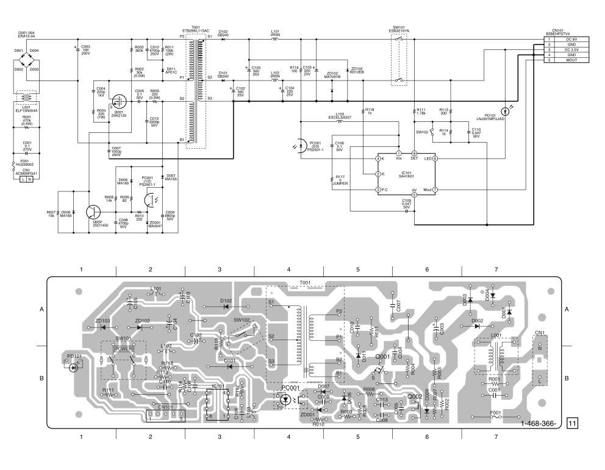
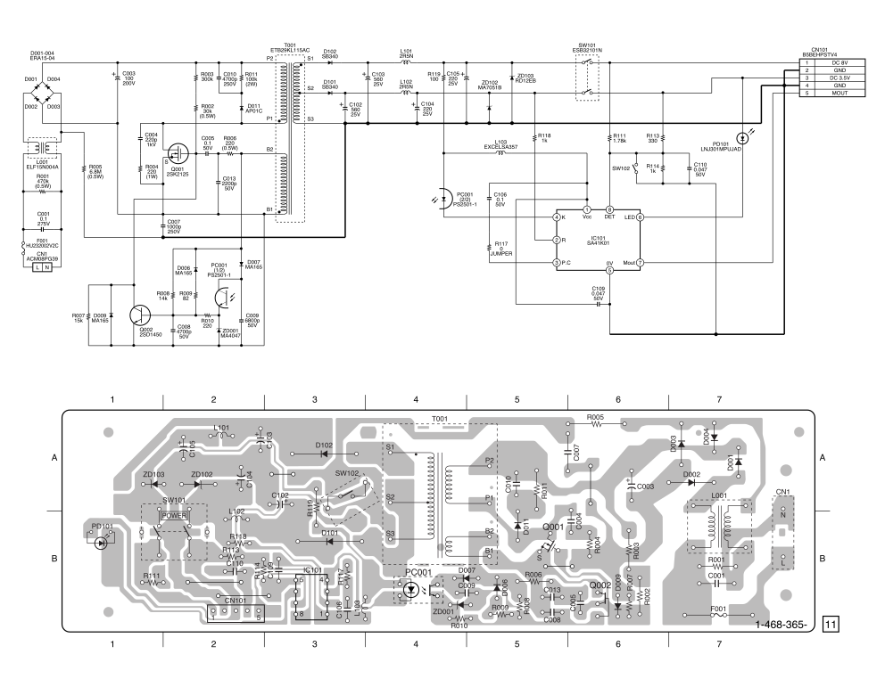
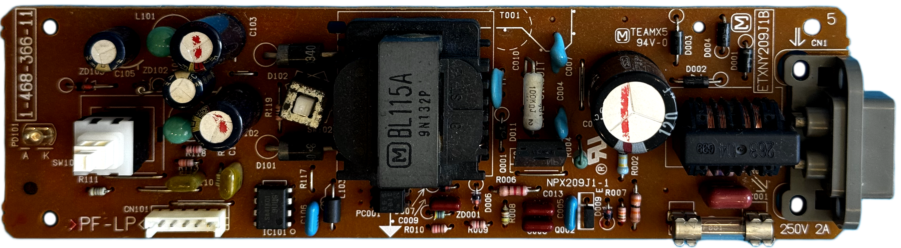
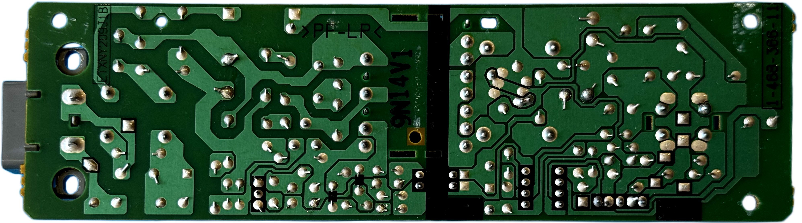
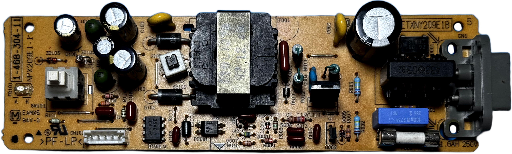
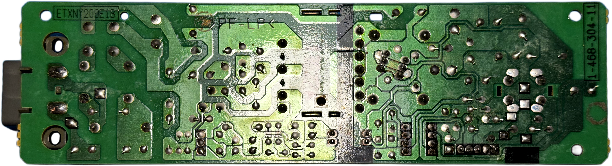

# Matsushita (Panasonic) ETXNY209 (NPX209J1-1) PSU for Sony PlayStation (PSX/PS1) &ndash; specs, schematics and photos

Late fat model power supply family.

| Sony # | Man&mu;Facturer # | Voltage | Models | Notes |
| :--- | :--- | :--- | :--- | :--- |
| `1-468-366-11` | `ETXNY209J1B` (NPX209J1-1) | 100V | SCPH-5500, 7000, 7500, 9000 | Japan |
| `1-468-365-11` | `ETXNY209A1B` | 120V | SCPH-5501, 7001, 7501, 9001 | North America |
| `1-468-365-12` | `ETXNY209A1BA` | 120V | SCPH-5501, 7001, 7501, 9001 | North America |
| `1-468-304-11` | `ETXNY209E1B` (NPX209E1-1) | 220–240V | SCPH-5502, 7002 | Europe |

## Schematics

*⚠️ The **ETXNY209A1B** (1-468-365-1x) and **ETXNY209J1B** (1-468-366-1x) are totally equal, besides the absence of the R005 resistor in
 **ETXNY209J1B**.*

### ETXNY209J1B

### ETXNY209A1B(A)

## Photos

### ETXNY209J1B

| Board top | Board bottom |
| :--- | :--- |
|  |  |

### ETXNY209E1B

| Board top | Board bottom |
| :--- | :--- |
|  |  |

## 🔧 Component List

### ETXNY209J1B

| Component | Original Label | Actual Chip / Function | Voltage | Note |
| :--- | :--- | :--- | :--- | :--- |
| **C001** | 0.1&mu;F | Film Capacitor | 125V | — |
| **C003** | 100&mu;F | Electrolytic Capacitor | 200V | — |
| **C004** | 120&mu;F | Ceramic Capacitor | 200V | — |
| **C005** | 0.1&mu;F | Film Capacitor | 50V | — |
| **C007** | 1000pF | Ceramic Capacitor | 250V | — |
| **C008** | 4700pF | Film Capacitor | 50V | — |
| **C009** | 6800pF | Film Capacitor | 50V | — |
| **C010** | 4700pF | Ceramic Capacitor | 250V | — |
| **C013** | 2200pF | Film Capacitor | 50V | — |
| **C102** | 560&mu;F | Electrolytic Capacitor | 25V | — |
| **C103** | 560&mu;F | Electrolytic Capacitor | 25V | — |
| **C104** | 220&mu;F | Electrolytic Capacitor | 25V | — |
| **C105** | 220&mu;F | Electrolytic Capacitor | 25V | — |
| **C106** | 0.1&mu;F | Film Capacitor | 50V | — |
| **C109** | 0.047&mu;F | Film Capacitor | 50V | — |
| **C110** | 0.047&mu;F | Film Capacitor | 50V | — |
| **D001** | — | Rectifier Diode | — | Part: ERA15-04 |
| **D002** | — | Rectifier Diode | — | Part: ERA15-04 |
| **D003** | — | Rectifier Diode | — | Part: ERA15-04 |
| **D004** | — | Rectifier Diode | — | Part: ERA15-04 |
| **D006** | — | Signal Diode | — | Part: MA165 |
| **D007** | — | Signal Diode | — | Part: MA165 |
| **D009** | — | Signal Diode | — | Part: MA165 |
| **D011** | — | Diode | — | Part: AP01C |
| **D101** | — | Schottky Diode | — | Part: SB340 |
| **D102** | — | Schottky Diode | — | Part: SB340 |
| **PD101** | — | LED | — | Part: LNJ301MPUJAD |
| **ZD001** | — | Zener Diode | — | Part: MA4047 |
| **ZD102** | — | Zener Diode | — | Part: MA7051B |
| **ZD103** | — | Zener Diode | — | Part: RD12EB |
| **F001** | — | Fuse | 250V | 2A |
| **IC101** | VISA41K01 | Feedback / Regulation IC | — | Part: VISA41K01 |
| **L001** | — | Choke Coil | — | Part: ELF15N004A |
| **L101** | 2R5N | Choke Coil | — | Part: 2R5N |
| **L102** | 2R5N | Choke Coil | — | Part: 2R5N |
| **L103** | — | Inductor | — | Part: EXCELSA35T |
| **Q001** | 2SK2125 | N-Channel Power MOSFET | — | Part: 2SK2125 |
| **Q002** | 2SD1450 | NPN Transistor | — | Part: 2SD1450 |
| **PC001** | PS2501-1 | Photocoupler | — | Part: PS2501-1 |
| **T001** | ETB29KL115AC | Transformer | — | Part: ETB29KL115AC |
| **R001** | 🟨🟪🟨⚪ | Carbon Resistor | — | 470k&Omega;, 1/2W |
| **R002** | 🟧⚫🟧⚪ | Carbon Resistor | — | 30k&Omega;, 1/2W |
| **R003** | 🟧⚫🟨⚪ | Metal Resistor | — | 300k&Omega;, 1/4W |
| **R004** | 🟥🟥🟫⚪ | Metal Resistor | — | 220&Omega;, 1W |
| **R006** | 🟥🟥🟫⚪ | Carbon Resistor | — | 220&Omega;, 1/2W |
| **R007** | 🟫🟩🟧⚪ | Carbon Resistor | — | 15k&Omega;, 1/4W |
| **R008** | 🟫🟧🟪⚪ | Metal Resistor | — | 13.0k&Omega;–15.0k&Omega;, 1/4W |
| **R009** | 🟧🟧⚫⚪ | Carbon Resistor | — | 82&Omega;, 1/4W |
| **R010** | 🟥🟥🟫⚪ | Carbon Resistor | — | 220&Omega;, 1/4W |
| **R011** | 🟫🟪🟨⚪ | Metal Resistor | — | 82k&Omega;–120k&Omega;, 2W |
| **R111** | 🟫🟪🟪⚪ | Metal Resistor | — | 1.78k&Omega;, 1/4W |
| **R113** | 🟥🟥🟫⚪ | Carbon Resistor | — | 220&Omega;–360&Omega;, 1/4W |
| **R114** | 🟫⚫🟥⚪ | Metal Resistor | — | 1k&Omega;, 1/4W |
| **R117** | N/A | Jumper | — | 0&Omega; |
| **R118** | 🟫⚫🟥⚪ | Carbon Resistor | — | 1k&Omega;, 1/4W |
| **R119** | 🟫⚫🟫⚪ | Carbon Resistor | — | 100&Omega;, 1/4W |

### ETXNY209A1B

| Component | Original Label | Actual Chip / Function | Voltage | Note |
| :--- | :--- | :--- | :--- | :--- |
| **C001** | 0.1&mu;F | Film Capacitor | 275V | — |
| **C003** | 100&mu;F | Electrolytic Capacitor | 200V | — |
| **C004** | 220pF | Ceramic Capacitor | 1kV | — |
| **C005** | 0.1&mu;F | Film Capacitor | 50V | — |
| **C007** | 1000pF | Ceramic Capacitor | 250V | — |
| **C008** | 4700pF | Film Capacitor | 50V | — |
| **C009** | 6800pF | Film Capacitor | 50V | — |
| **C010** | 4700pF | Ceramic Capacitor | 250V | — |
| **C013** | 2200pF | Film Capacitor | 50V | — |
| **C102** | 560&mu;F | Electrolytic Capacitor | 25V | — |
| **C103** | 560&mu;F | Electrolytic Capacitor | 25V | — |
| **C104** | 220&mu;F | Electrolytic Capacitor | 25V | — |
| **C105** | 220&mu;F | Electrolytic Capacitor | 25V | — |
| **C106** | 0.1&mu;F | Film Capacitor | 50V | — |
| **C109** | 0.047&mu;F | Film Capacitor | 50V | — |
| **C110** | 0.047&mu;F | Film Capacitor | 50V | — |
| **D001** | — | Rectifier Diode | — | Part: ERA15-04 |
| **D002** | — | Rectifier Diode | — | Part: ERA15-04 |
| **D003** | — | Rectifier Diode | — | Part: ERA15-04 |
| **D004** | — | Rectifier Diode | — | Part: ERA15-04 |
| **D006** | — | Signal Diode | — | Part: MA165 |
| **D007** | — | Signal Diode | — | Part: MA165 |
| **D009** | — | Signal Diode | — | Part: MA165 |
| **D011** | — | Diode | — | Part: AP01C |
| **D101** | — | Schottky Diode | — | Part: SB340 |
| **D102** | — | Schottky Diode | — | Part: SB340 |
| **PD101** | — | LED | — | Part: LNJ301MPUJAD |
| **ZD001** | — | Zener Diode | — | Part: MA4047 |
| **ZD102** | — | Zener Diode | — | Part: MA7051B |
| **ZD103** | — | Zener Diode | — | Part: RD12EB |
| **F001** | — | Fuse | 250V | 2A |
| **IC101** | VISA41K01 | Feedback / Regulation IC | — | Part: VISA41K01 |
| **L001** | — | Choke Coil | — | Part: ELF15N004A |
| **L101** | 2R5N | Choke Coil | — | Part: 2R5N |
| **L102** | 2R5N | Choke Coil | — | Part: 2R5N |
| **L103** | — | Inductor | — | Part: EXCELSA35 |
| **Q001** | 2SK2125 | N-Channel Power MOSFET | — | Part: 2SK2125 |
| **Q002** | 2SD1450 | NPN Transistor | — | Part: 2SD1450 |
| **PC001** | PS2501-1 | Photocoupler | — | Part: PS2501-1 |
| **T001** | ETB29KL115AC | Transformer | — | Part: ETB29KL115AC |
| **R001** | 🟨🟪🟨⚪ | Carbon Resistor | — | 470k&Omega;, 1/2W |
| **R002** | 🟧⚫🟧⚪ | Carbon Resistor | — | 30k&Omega;, 1/2W |
| **R003** | 🟧⚫🟨⚪ | Metal Resistor | — | 300k&Omega;, 1/4W |
| **R004** | 🟥🟥🟫⚪ | Metal Resistor | — | 220&Omega;, 1W |
| **R005** | 🟦⚪⚫⚪ | Carbon Resistor | — | 6.8M&Omega;, 1/2W |
| **R006** | 🟥🟥🟫⚪ | Carbon Resistor | — | 220&Omega;, 1/2W |
| **R007** | 🟫🟩🟧⚪ | Carbon Resistor | — | 15k&Omega;, 1/4W |
| **R008** | 🟫🟧🟪⚪ | Metal Resistor | — | 13.0k&Omega;–15.0k&Omega;, 1/4W |
| **R009** | 🟧🟧⚫⚪ | Carbon Resistor | — | 82&Omega;, 1/4W |
| **R010** | 🟥🟥🟫⚪ | Carbon Resistor | — | 220&Omega;, 1/4W |
| **R011** | 🟫🟪🟨⚪ | Metal Resistor | — | 82k&Omega;–120k&Omega;, 2W |
| **R111** | 🟫🟪🟪⚪ | Metal Resistor | — | 1.78k&Omega;, 1/4W |
| **R113** | 🟥🟥🟫⚪ | Carbon Resistor | — | 220&Omega;–360&Omega;, 1/4W |
| **R114** | 🟫⚫🟥⚪ | Metal Resistor | — | 1k&Omega;, 1/4W |
| **R117** | N/A | Jumper | — | 0&Omega; |
| **R118** | 🟫⚫🟥⚪ | Carbon Resistor | — | 1k&Omega;, 1/4W |
| **R119** | 🟫⚫🟫⚪ | Carbon Resistor | — | 100&Omega;, 1/4W |