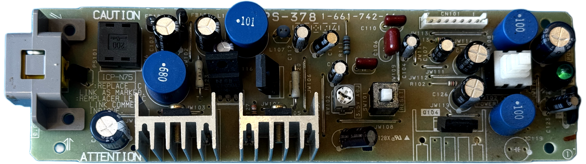
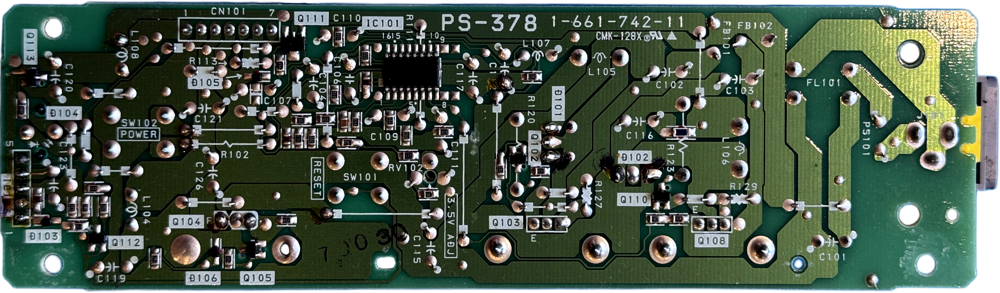

# Sony PS-378 PSU for Sony PlayStation (PSX/PS1) &ndash; specs, schematics and photos

| Sony # | Manufacturer # | Voltage | Models | Notes |
| :--- | :--- | :--- | :--- | :--- |
| `1-661-742-11` | `PS-378` | 12V | DTL-H110x | Developer/debug station, needs an external 12V-adaptor |

## Photos

| Board top | Board bottom |
| :--- | :--- |
|  |  |

## Schematics

_None yet._