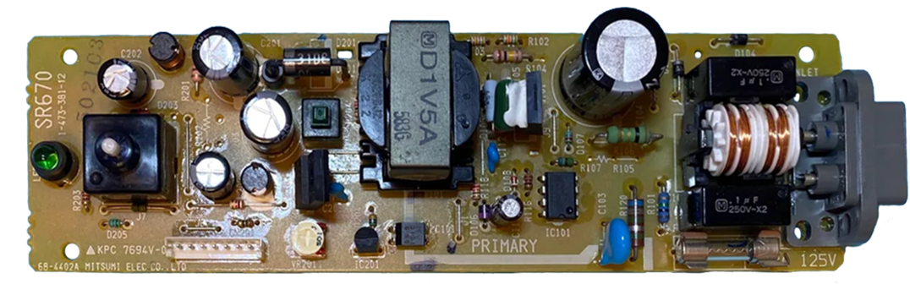

# Mitsumi SR670 PSU for Sony PlayStation (PSX/PS1) &ndash; specs, schematics and photos

| Sony # | Manufacturer # | Voltage | Models | Notes |
| :--- | :--- | :--- | :--- | :--- |
| `1-473-381-11` | `SR670` | 120V | SCPH-1001 | North America |
| `1-473-381-12` | `SR670` | 120V | SCPH-1001 | North America |
| `1-473-381-13` | `SR670` | 120V | SCPH-1001 | North America |
| `1-473-381-15` | `SR670` | 120V | SCPH-1001 | North America |

## Schematics

_None yet._

## Photos

### SR670

| Board top | Board bottom |
| :--- | :--- |
|  | |

## Capacitors

For `1-473-381-11`, `1-473-381-13` (SR670, 68-4402A/B). Source: [RetroSix Wiki — Capacitors (Sony PlayStation 1)](https://retrosix.wiki/wiki/capacitors-sony-playstation-1). All THT.

| Designator | Value | Voltage | Mounting |
| :--- | :--- | :--- | :--- |
| C111 | 47&mu;F | 35V | THT |
| C104 | 120&mu;F | 200V | THT |
| C202 | 470&mu;F | 16V | THT |
| C201 | 1000&mu;F | 16V | THT |
| C204 | 1000&mu;F | 6.3V | THT |
| C203 | 2200&mu;F | 10V | THT |