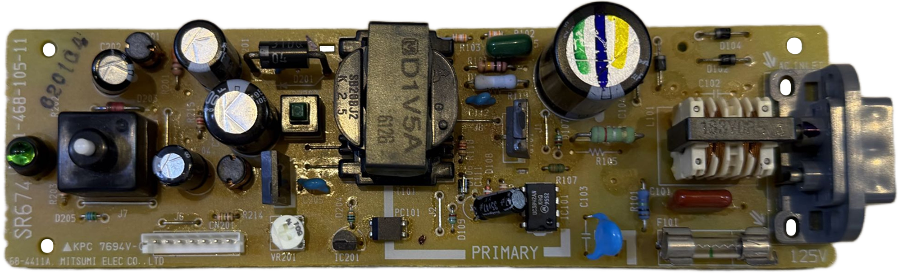
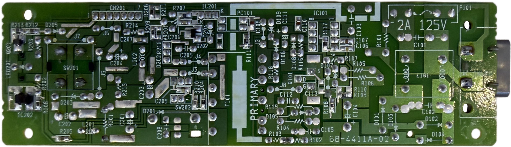
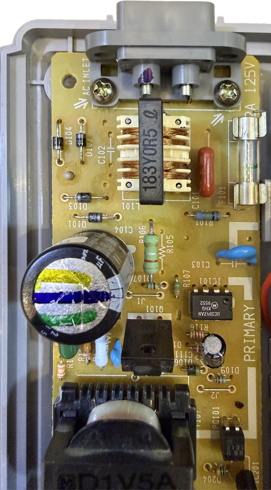
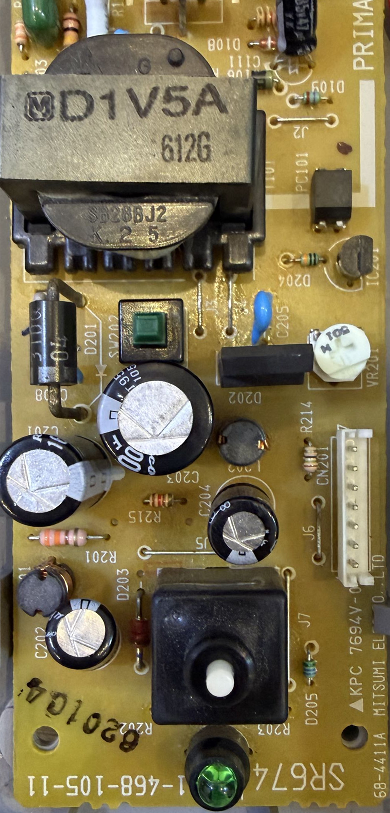

# Mitsumi SR674 PSU for Sony PlayStation (PSX/PS1) &ndash; specs, schematics and photos

| Sony # | Manufacturer # | Voltage | Models | Notes |
| :--- | :--- | :--- | :--- | :--- |
| `1-468-105-11` | `SR674` | 100V | SCPH-1000, 3000, 3500, 5000 | Japan |
| `1-468-105-12` | `SR674` | 100V | SCPH-1000, 3000, 3500, 5000 | Japan |

## Schematics

_None yet._

## Photos
### General view
| Board top | Board bottom |
| :--- | :--- |
|  |  |

## Close-ups

