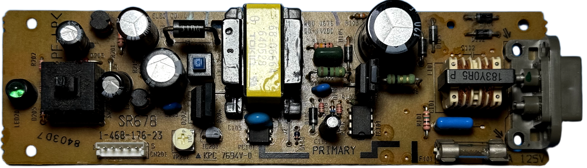
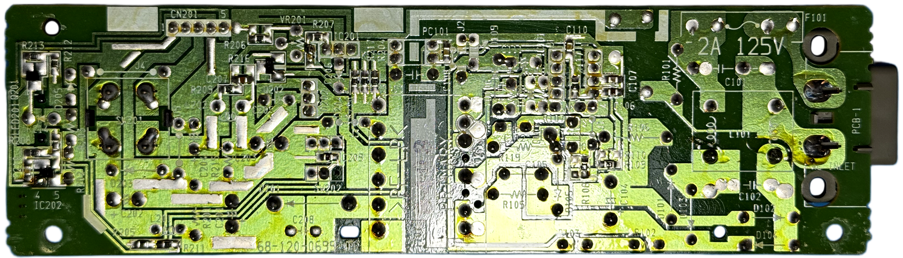

# Mitsumi SR678 PSU for Sony PlayStation (PSX/PS1) &ndash; specs, schematics and photos

| Sony # | Man&mu;Facturer # | Voltage | Models | Notes |
| :--- | :--- | :--- | :--- | :--- |
| `1-468-176-23` | `SR678` | 100V | SCPH-5500, 7000, 7500, 9000 | Japan |

## Photos

| Board top | Board bottom |
| :--- | :--- |
|  |  |
