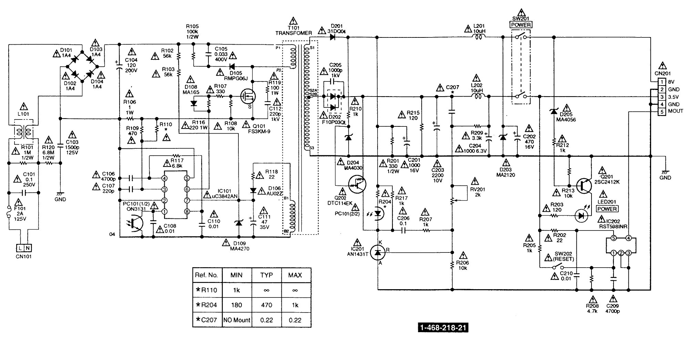
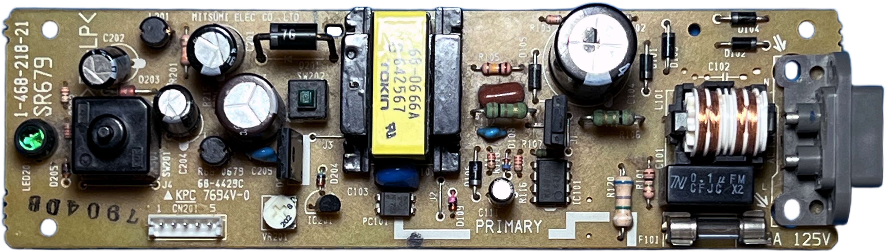
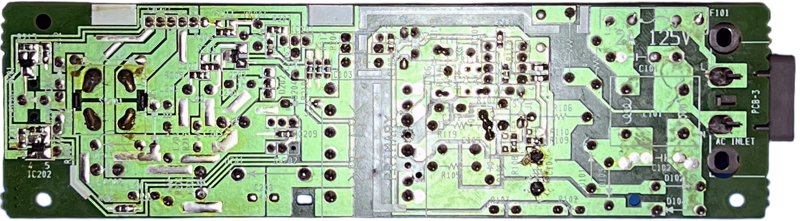

# Mitsumi SR679 PSU for Sony PlayStation (PSX/PS1) &ndash; reverse engineering

| Sony # | Manufacturer # | Voltage | Models | Notes |
| :--- | :--- | :--- | :--- | :--- |
| `1-468-218-21` | `SR679` | 100-120V | SCPH-5501, 7001, 7501, 9001 | North America |

## Schematics

## Photos

| Board top | Board bottom |
| :--- | :--- |
|  |  |
