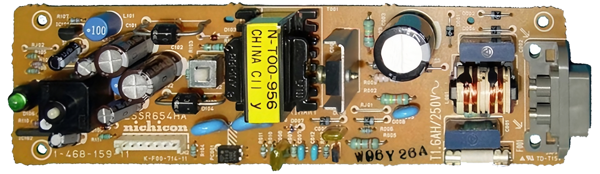

# ZSSR654HA (Nichicon, 7-pin)

| Sony # | Man&mu;Facturer # | Voltage | Models | Notes |
| :--- | :--- | :--- | :--- | :--- |
| `1-468-159-11` | `ZSSR654HA` | 220–240V | SCPH-1002| Europe |

## 📷 Board Photos

### Top / Bottom

| Top side | Bottom side |
| :--- | :--- |
|  | |

## Schematics

_None yet._
