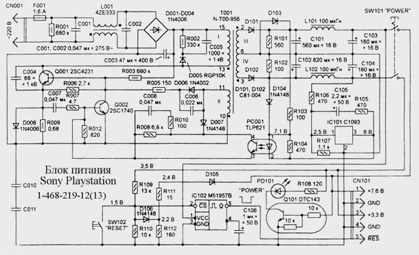

# Nichicon ZSSR698HA PSU for Sony PlayStation (PSX/PS1) &ndash; reverse engineering

### 🚧 Status & Known Limitations

- **Schematic can be incomplete and is UNVERIFIED:** The provided schematic is a best-effort reconstruction based on tracing a physical board. It may contain errors, missing components, or incorrect net labels.
- **Testing is ongoing:** I have **not yet fully verified** that the schematic is 100% accurate under all load conditions.
- **Use at your own risk:** This is a **high-voltage device**. Incorrect assumptions can lead to dangerous short circuits, component damage, or personal injury. Do not use this schematic as a primary source for manufacturing or cloning without independent verification.

### Known Revisions

**ZSSR698HA** family:

| Sony Part No. | Manufacturer Part No. | Tested |
| :--- | :--- | :--- |
| `1-468-219-11` | `ZSSR698HA` | |
| `1-468-219-12` | `ZSSR698HA` | |
| `1-468-219-13` | `ZSSR698HA` | &#9989; |

See [my document](../../psu/README.md) for the full (not sure)  PlayStation PSU list.

### Schematic

⚠️ **Warning** This schematic was found in the internet and is not verified so far.

## 📷 Board Photos

### Top / Bottom

| Top side | Bottom side |
| :--- | :--- |
|  |  |

## 🔧 Component List & Common Substitutions

| Component | Value | Voltage | Note |
| :--- | :--- | :--- | :--- |
| **C003** | 47&mu;F | 400V | Main capacitor |
| **C103, C104** | 180&mu;F | 16V | |
| **C101** | 560&mu;F | 16V | |
| **C102** | 820&mu;F | 16V | |
| **C105** | 2.2&mu;F | 50V | |
| **C106** | 1&mu;F | 50V | |

## Capacitors in detail

See the [RetroSix Wiki &ndash; Capacitors (Sony PlayStation 1)](https://retrosix.wiki/wiki/capacitors-sony-playstation-1). All THT.

| Designator | Value | Voltage |
| :--- | :--- | :--- |
| C106 | 1uF | 50V |
| C105 | 2.2uF | 50V |
| C003 | 47uF | 400V |
| C103, C104 | 180uF | 16V |
| C101 | 560uF | 16V |
| C102 | 820uF | 16V |
