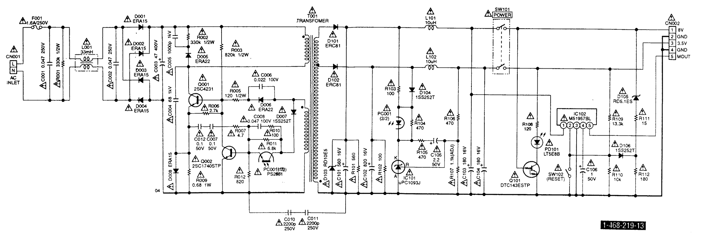
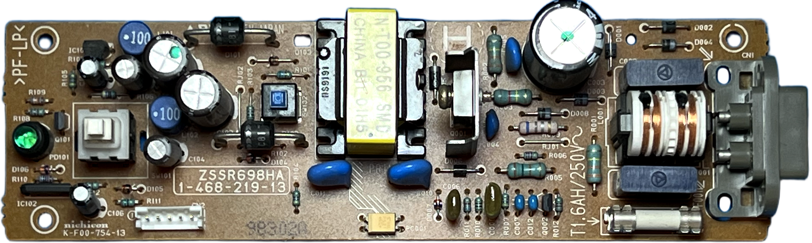
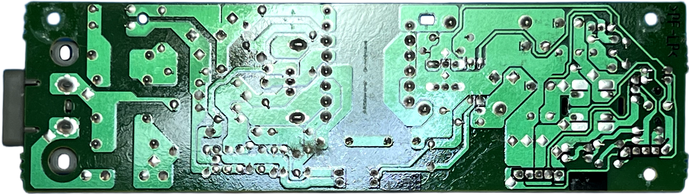

# Nichicon ZSSR698HA PSU for Sony PlayStation (PSX/PS1) &ndash; specs, schematics and photos

### Known Revisions

**ZSSR698HA** family:

| Sony # | Manufacturer # | Voltage | Models | Notes |
| :--- | :--- | :--- | :--- | :--- |
| `1-468-219-11` | `ZSSR698HA` | 220-240V | SCPH-5502, 5552, 7002| Europe |
| `1-468-219-12` | `ZSSR698HA` | 220-240V | SCPH-5502, 5552, 7002| Europe |
| `1-468-219-13` | `ZSSR698HA` | 220-240V | SCPH-5502, 5552, 7002| Europe |

### Schematic

### ZSSR698HA

## 📷 Board Photos

### Top / Bottom

| Top side | Bottom side |
| :--- | :--- |
|  |  |

## 🔧 Component List

| Component | Original Label | Actual Chip / Function | Voltage | Note |
| :--- | :--- | :--- | :--- | :--- |
| **C001** | 0.047&mu;F | Film Capacitor | 250V | Part: QEX2E473KTP2CS |
| **C002** | 0.047&mu;F | Film Capacitor | 250V | Part: QEX2E473KTP2CS |
| **C003** | 47&mu;F | Electrolytic Capacitor | 400V | Part: UVZ2G470MHH6TN |
| **C004** | 68PF | Ceramic Capacitor | 1KV | Part: TP007SL680J1K |
| **C005** | 1000PF | Ceramic Capacitor | 1KV | Part: TP009R102K1K |
| **C006** | 0.022&mu;F | Film Capacitor | 100V | Part: QYX2A223JTPSTA |
| **C007** | 0.1&mu;F | Ceramic Capacitor | 50V | Part: TRPE132R104K50 |
| **C008** | 0.047&mu;F | Film Capacitor | 100V | Part: QYX2A473JTPSTA |
| **C010** | 2200PF | Ceramic Capacitor | 250V | Part: TPZ10E222MGH |
| **C011** | 2200PF | Ceramic Capacitor | 250V | Part: TPZ10E222MGH |
| **C012** | 0.1&mu;F | Ceramic Capacitor | 50V | Part: TRPE132R104K50 |
| **C101** | 560&mu;F | Electrolytic Capacitor | 16V | Part: UPJ1C561MPH1TD |
| **C102** | 820&mu;F | Electrolytic Capacitor | 16V | Part: UPJ1C821MPH1TD |
| **C103** | 180&mu;F | Electrolytic Capacitor | 16V | Part: UPF1C181MEH1TA |
| **C104** | 180&mu;F | Electrolytic Capacitor | 16V | Part: UPF1C181MEH1TA |
| **C105** | 2.2&mu;F | Electrolytic Capacitor | 50V | Part: UVR1H2R2MDA1TA |
| **C106** | 1&mu;F | Electrolytic Capacitor | 50V | Part: UVR1H010MDA1TA |
| **CN001** | — | AC Inlet | — | Part: AC-M08PG39 |
| **CN002** | — | Connector | — | Part: B5B-EH-TS |
| **D001** | — | Rectifier Diode | 600V | 1A, Part: ERA15-06V3R |
| **D002** | — | Rectifier Diode | 600V | 1A, Part: ERA15-06V3R |
| **D003** | — | Rectifier Diode | 600V | 1A, Part: ERA15-06V3R |
| **D004** | — | Rectifier Diode | 600V | 1A, Part: ERA15-06V3R |
| **D005** | — | Fast Recovery Diode | 800V | 0.5A, Part: ERA22-08V3R |
| **D006** | — | Fast Recovery Diode | 200V | 0.5A, Part: ERA22-02V3R |
| **D007** | — | Signal Diode | 80V | 100mA, Part: 1SS252T-77 |
| **D008** | — | Rectifier Diode | 600V | 1A, Part: ERA15-06V3R |
| **D101** | — | Schottky Diode | 40V | 2.6A, Part: ERC81-004L |
| **D102** | — | Schottky Diode | 40V | 2.6A, Part: ERC81-004L |
| **D103** | — | Zener Diode | 10V | 400mA, Part: RD10ES-T1-AB2 |
| **D104** | — | Signal Diode | 80V | 100mA, Part: 1SS252T-77 |
| **D105** | — | Zener Diode | 5.1V | 400mA, Part: RD5.1ES-T1-AB2 |
| **D106** | — | Signal Diode | 80V | 100mA, Part: 1SS252T-77 |
| **F001** | — | Fuse | 250V | 1.6A, Part: 215SB-1R6AA-SB |
| **IC101** | uPC1093J-1-T | Shunt Regulator | — | Part: uPC1093J-1-T |
| **IC102** | M51957BL | Reset / Supervisory IC | — | Part: M51957BL |
| **L001** | — | Coil | — | 33mH, 0.3A, Part: LF-4D-333 |
| **L101** | — | Coil | — | 10&mu;H, 1.9A, Part: TSL0709RA100K1R9 |
| **L102** | — | Coil | — | 10&mu;H, 1.9A, Part: TSL0709RA100K1R9 |
| **PC001** | PS2561-1DV | Photocoupler | 80V | 80mA, Part: PS2561-1DV |
| **PD101** | — | LED | — | 30mA, Part: LT5E88 |
| **Q001** | 2SC4231 | NPN Transistor | 800V | 2.0A, Part: 2SC4231 |
| **Q002** | 2SC1740STP | NPN Transistor | 50V | 150mA, Part: 2SC1740STP |
| **Q101** | DTC143ESTP | Digital Transistor | 50V | 100mA, Part: DTC143ESTP |
| **R001** | 🟧 🟧 🟨 🟡 | Carbon Resistor | — | 330k&Omega;, 1/2W, Part: RDFP50ST5A334J |
| **R002** | 🟧 🟧 🟨 🟡 | Carbon Resistor | — | 330k&Omega;, 1/2W, Part: RDFP50ST5A334J |
| **R003** | ◻️ 🟥 🟨 🟡 | Carbon Resistor | — | 820k&Omega;, 1/2W, Part: RDFP50ST5A824J |
| **R005** | 🟫 🟥 🟫 🟡 | Carbon Resistor | — | 120&Omega;, 1/2W, Part: RDFP50ST5A151J |
| **R006** | 🟥 🟪 🟥 🟡 | Carbon Resistor | — | 2.7k&Omega;, 1/4W, Part: RDFP16ST2A272J |
| **R007** | 🟨 🟪 🟡 🟡 | Carbon Resistor | — | 4.7&Omega;, 1/4W, Part: RDFP16ST2A4R7J |
| **R009** | 🟦 ◻️ ⚪ 🟡 | Metal Oxide Resistor | — | 0.68&Omega;, 1W, Part: RSS01WST5AR68J |
| **R010** | 🟫 ⬛ 🟫 🟡 | Carbon Resistor | — | 100&Omega;, 1/4W, Part: RDFP16ST2A101J |
| **R011** | 🟦 ◻️ 🟥 🟡 | Carbon Resistor | — | 6.8k&Omega;, 1/4W, Part: RDFP16ST2A682J |
| **R012** | ◻️ 🟥 🟫 🟡 | Carbon Resistor | — | 820&Omega;, 1/4W, Part: RDFP16ST2A821J |
| **R101** | 🟩 🟦 🟫 🟡 | Carbon Resistor | — | 560&Omega;, 1/4W, Part: RDFP16ST2A561J |
| **R102** | 🟫 ⬛ 🟫 🟡 | Carbon Resistor | — | 100&Omega;, 1/4W, Part: RDFP16ST2A101J |
| **R103** | 🟫 ⬛ 🟫 🟡 | Carbon Resistor | — | 100&Omega;, 1/4W, Part: RDFP16ST2A101J |
| **R104** | 🟨 🟪 🟫 🟡 | Carbon Resistor | — | 470&Omega;, 1/4W, Part: RDFP16ST2A471J |
| **R105** | 🟨 🟪 🟫 🟡 | Carbon Resistor | — | 470&Omega;, 1/4W, Part: RDFP16ST2A471J |
| **R106** | 🟨 🟪 🟫 🟡 | Metal Resistor | — | 470&Omega;, 1/4W, Part: SNZP16ST2A4700D |
| **R107** | N/A | Metal Resistor | — | Value selected at factory; possible values: 953&Omega;, 965&Omega;, 976&Omega;, 988&Omega;, 1.0k&Omega;, 1.01k&Omega;, 1.02k&Omega;, 1.04k&Omega;, 1.05k&Omega;, 1.06k&Omega;, 1.07k&Omega;, 1.09k&Omega;, 1.11k&Omega;, 1.13k&Omega;, 1/4W |
| **R108** | 🟫 🟥 🟫 🟡 | Carbon Resistor | — | 120&Omega;, 1/4W, Part: RDFP16ST2A121J |
| **R109** | 🟫 🟧 🟧 🟥 🟤 | Metal Resistor | — | 13.3k&Omega;, 1/4W, Part: SNZP16ST2A1332F |
| **R110** | 🟫 ⬛ ⬛ 🟥 🟤 | Metal Resistor | — | 10k&Omega;, 1/4W, Part: SNZP16ST2A1002F |
| **R111** | 🟫 🟩 ⬛ 🟡 | Carbon Resistor | — | 15&Omega;, 1/4W, Part: RDFP16ST2A150J |
| **R112** | 🟫 ◻️ 🟫 🟡 | Carbon Resistor | — | 180&Omega;, 1/4W, Part: RDFP16ST2A181J |
| **SW101** | — | Power Switch | 12V | 3A, Part: SL-ASBB03 |
| **SW102** | — | Reset Switch | 12V | 3A, Part: ESE20B9 |
| **T001** | N-T00-956C | Converter Transformer | — | Part: N-T00-956C |

#### Color Legend

| Emoji | Color |
| :--- | :--- |
| 🟥 | Red |
| 🟧 | Orange |
| 🟨 | Yellow |
| 🟩 | Green |
| 🟦 | Blue |
| 🟪 | Violet |
| 🟫 | Brown |
| ⬛ | Black |
| ⬜ | **White** |
| ◻️ | **Grey** |
| ⚪ | **Silver** (×0.01 multiplier) |
| 🟡 | Gold |
| 🟤 | Brown |

Resistor color bands are read as **digit – digit – multiplier – tolerance**; 1% (F) parts use five bands, **digit – digit – digit – multiplier – tolerance**. Zener diodes use the same codes, with the **first band doubled** (e.g. `🟨🟨` = yellow-yellow) to mark the cathode side, bands of same color mean decimal point (e.g. 🟩 = 5, 🟫 = 1, 🟩🟩 🟫 🟫  = 5.1V ). The tolerance ring is circular: 🟡 gold (5%), 🟤 brown (1%); `⚪` silver (×0.01) is a multiplier band, not a tolerance. All value bands are squares (⬛ black, ⬜ white, ◻️ grey, …). In the multiplier slot `🟡` = gold (×0.1) and `⚪` = silver (×0.01).
