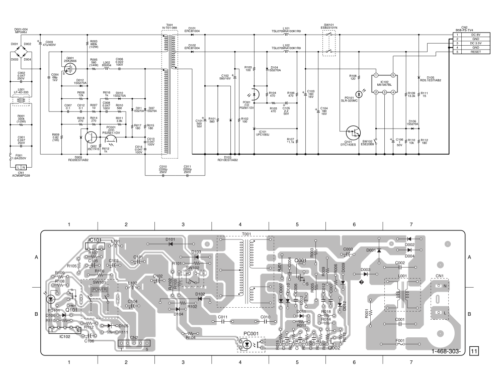
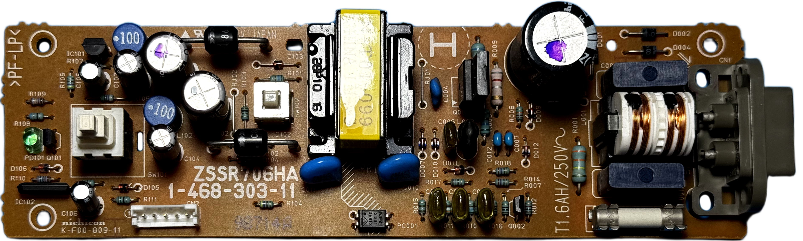
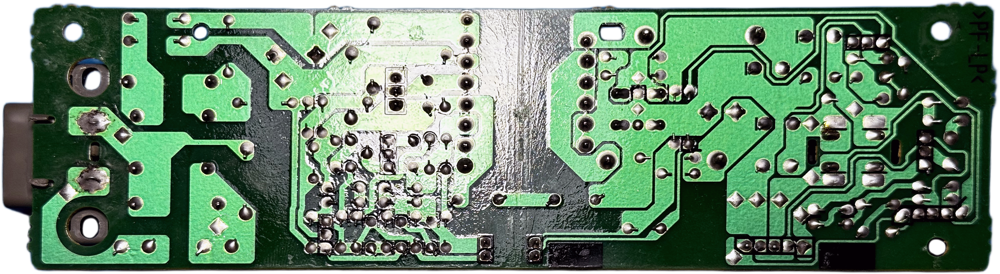
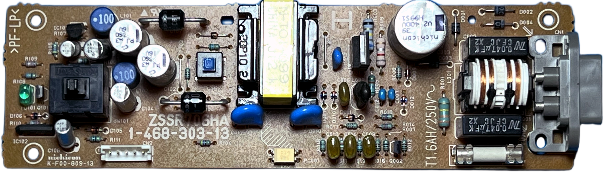
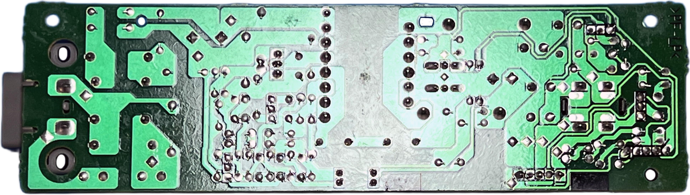

# Nichicon ZSSR706HA PSU for Sony PlayStation (PSX/PS1) &ndash; specs, schematics and photos

| Sony # | Manufacturer # | Voltage | Models | Notes |
| :--- | :--- | :--- | :--- | :--- |
| `1-468-303-11` | `ZSSR706HA` | 220–240V | SCPH-5502, 7002, 7502, 9002 | Europe |
| `1-468-303-12` | `ZSSR706HA` | 220–240V | SCPH-5502, 7002, 7502, 9002 | Europe |
| `1-468-303-13` | `ZSSR706HA` | 220–240V | SCPH-5502, 7002, 7502, 9002 | Europe |

⚠️ *Sony manuals incorrectly list **1-468-303-13** as 1-468-303-31*

## Schematics

### ZSS706HA 

## Photos

| Board top | Board bottom |
| :--- | :--- |
|  |  |
|  |  |

### 🔧 Component List

| Component | Original Label | Actual Chip / Function | Voltage | Note |
| :--- | :--- | :--- | :--- | :--- |
| **C001** | 0.047&mu;F | Film Capacitor | 250V | — |
| **C002** | 0.047&mu;F | Film Capacitor | 250V | — |
| **C003** | 47&mu;F | Electrolytic Capacitor | 400V | — |
| **C004** | 68pF | Ceramic Capacitor | 1kV | — |
| **C006** | 0.022&mu;F | Film Capacitor | 100V | — |
| **C007** | 0.1&mu;F | Ceramic Capacitor | 50V | — |
| **C008** | 0.047&mu;F | Film Capacitor | 100V | — |
| **C010** | 2200pF | Ceramic Capacitor | 250V | — |
| **C011** | 2200pF | Ceramic Capacitor | 250V | — |
| **C012** | 0.1&mu;F | Ceramic Capacitor | 50V | — |
| **C013** | 0.047&mu;F | Film Capacitor | 100V | — |
| **C014** | 0.047&mu;F | Film Capacitor | 100V | — |
| **C101** | 560&mu;F | Electrolytic Capacitor | 16V | — |
| **C102** | 560&mu;F | Electrolytic Capacitor | 16V | — |
| **C103** | 180&mu;F | Electrolytic Capacitor | 16V | — |
| **C104** | 180&mu;F | Electrolytic Capacitor | 16V | — |
| **C105** | 2.2&mu;F | Electrolytic Capacitor | 50V | — |
| **C106** | 1&mu;F | Electrolytic Capacitor | 50V | — |
| **D001** | — | Rectifier Diode | — | Part: MPG06J |
| **D002** | — | Rectifier Diode | — | Part: MPG06J |
| **D003** | — | Rectifier Diode | — | Part: MPG06J |
| **D004** | — | Rectifier Diode | — | Part: MPG06J |
| **D007** | — | Signal Diode | — | Part: 1SS270A |
| **D009** | 🟥 🟥 ⬛ | Zener Diode | — | Part: RD20EST10AB2 |
| **D010** | — | Signal Diode | — | Part: 1SS270A |
| **D011** | — | Signal Diode | — | Part: 1SS270A |
| **D012** | — | Signal Diode | — | Part: 1SS270A |
| **D101** | — | Rectifier Diode | — | Part: ERCB1004 |
| **D102** | — | Rectifier Diode | — | Part: ERCB1004 |
| **D103** | 🟫 🟫 ⬛ | Zener Diode | — | Part: RD10EST1AB2 |
| **D104** | — | Signal Diode | — | Part: 1SS270A |
| **D105** | 🟩 🟩 🟫 🟫 | Zener Diode | — | Part: RD5.1EST1AB2 |
| **D106** | — | Signal Diode | — | Part: 1SS270A |
| **PD101** | — | LED | — | Part: SLR-325MC |
| **F001** | — | Fuse | 250V | 1.6A |
| **IC101** | UPC1093J | Shunt Regulator | — | Part: UPC1093J |
| **IC102** | M51957BL | Reset / Supervisory IC | — | Part: M51957BL |
| **L001** | — | Choke Coil | — | Part: LF-4D-333 |
| **L002** | — | Choke Coil | — | Part: RS204 |
| **L101** | — | Choke Coil | — | Part: TSL0709RA100K1R9 |
| **L102** | — | Choke Coil | — | Part: TSL0709RA100K1R9 |
| **Q001** | 2SK2666 | N-Channel Power MOSFET | — | Part: 2SK2666 |
| **Q002** | 2SC1741S | NPN Transistor | — | Part: 2SC1741S |
| **Q101** | DTC143ES | Digital Transistor | — | Part: DTC143ES |
| **PC001** | PS2561-1DV | Photocoupler | — | Part: PS2561-1DV |
| **T001** | N-T01-099 | Transformer | — | Part: N-T01-099 |
| **R001** | 🟧 🟧 🟨 🟡 | Carbon Resistor | — | 330k&Omega;, 1/2W |
| **R003** | 🟦 ◻️ 🟨 🟡 | Carbon Resistor | — | 680k&Omega;, 1/2W |
| **R005** | 🟩 🟦 🟫 🟡 | Carbon Resistor | — | 560&Omega;, 1/4W |
| **R006** | 🟫 🟥 🟧 🟡 | Carbon Resistor | — | 12k&Omega;, 1/4W |
| **R007** | 🟫 ⬛ ⬛ 🟡 | Carbon Resistor | — | 10&Omega;, 1/4W |
| **R009** | ◻️ 🟥 ⚪ 🟡 | Metal Resistor | — | 0.82&Omega;, 1W |
| **R010** | 🟩 🟦 🟫 🟡 | Carbon Resistor | — | 560&Omega;, 1/4W |
| **R011** | 🟧 ⬜ 🟥 🟡 | Carbon Resistor | — | 3.9k&Omega;, 1/4W |
| **R012** | 🟫 ⬛ 🟥 🟡 | Carbon Resistor | — | 1k&Omega;, 1/4W |
| **R014** | 🟥 🟪 🟫 🟡 | Carbon Resistor | — | 270&Omega;, 1/4W |
| **R015** | 🟫 ◻️ 🟫 🟡 | Carbon Resistor | — | 180&Omega;, 1/4W |
| **R016** | 🟫 ⬛ 🟥 🟡 | Carbon Resistor | — | 1k&Omega;, 1/4W |
| **R017** | 🟫 ◻️ 🟫 🟡 | Carbon Resistor | — | 180&Omega;, 1/4W |
| **R018** | 🟥 🟪 🟫 🟡 | Carbon Resistor | — | 270&Omega;, 1/4W |
| **R101** | 🟩 🟦 🟫 🟡 | Carbon Resistor | — | 560&Omega;, 1/4W |
| **R102** | 🟫 ⬛ 🟫 🟡 | Carbon Resistor | — | 100&Omega;, 1/4W |
| **R103** | 🟫 ⬛ 🟫 🟡 | Carbon Resistor | — | 100&Omega;, 1/4W |
| **R104** | 🟨 🟪 🟫 🟡 | Carbon Resistor | — | 470&Omega;, 1/4W |
| **R105** | 🟨 🟪 🟫 🟡 | Carbon Resistor | — | 470&Omega;, 1/4W |
| **R106** | 🟨 🟪 🟫 🟡 | Metal Resistor | — | 470&Omega;, 1/4W |
| **R107** | — | Metal Resistor (selected) | — | Value selected at factory; possible range: 953&Omega;–1.13k&Omega; |
| **R108** | 🟫 🟥 🟫 🟡 | Carbon Resistor | — | 120&Omega;, 1/4W |
| **R109** | 🟫 🟧 🟧 🟥 🟤 | Metal Resistor | — | 13.3k&Omega;, 1/4W |
| **R110** | 🟫 ⬛ 🟧 🟡 | Metal Resistor | — | 10k&Omega;, 1/4W |
| **R111** | 🟫 🟩 ⬛ 🟡 | Carbon Resistor | — | 15&Omega;, 1/4W |
| **R112** | 🟫 ◻️ 🟫 🟡 | Carbon Resistor | — | 180&Omega;, 1/4W |

#### Color Legend

| Emoji | Color |
| :--- | :--- |
| 🟥 | Red |
| 🟧 | Orange |
| 🟨 | Yellow |
| 🟩 | Green |
| 🟦 | Blue |
| 🟪 | Violet |
| 🟫 | Brown |
| ⬛ | Black |
| ⬜ | **White** |
| ◻️ | **Grey** |
| ⚪ | **Silver** (×0.01 multiplier) |
| 🟡 | Gold |
| 🟤 | Brown |

Resistor color bands are read as **digit – digit – multiplier – tolerance**; 1% (F) parts use five bands, **digit – digit – digit – multiplier – tolerance**. Zener diodes use the same codes, with the **first band doubled** (e.g. `🟨🟨` = yellow-yellow) to mark the cathode side, bands of same color mean decimal point (e.g. 🟩 = 5, 🟫 = 1, 🟩🟩 🟫 🟫  = 5.1V ). The tolerance ring is circular: 🟡 gold (5%), 🟤 brown (1%); `⚪` silver (×0.01) is a multiplier band, not a tolerance. All value bands are squares (⬛ black, ⬜ white, ◻️ grey, …). In the multiplier slot `🟡` = gold (×0.1) and `⚪` = silver (×0.01).
